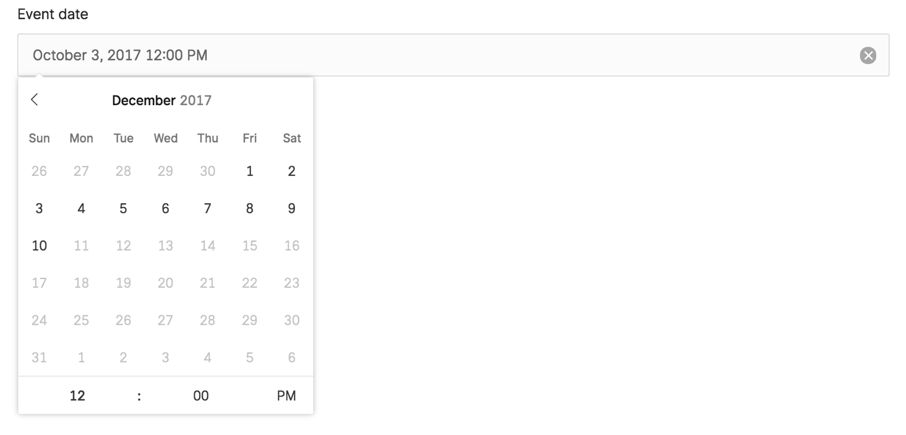
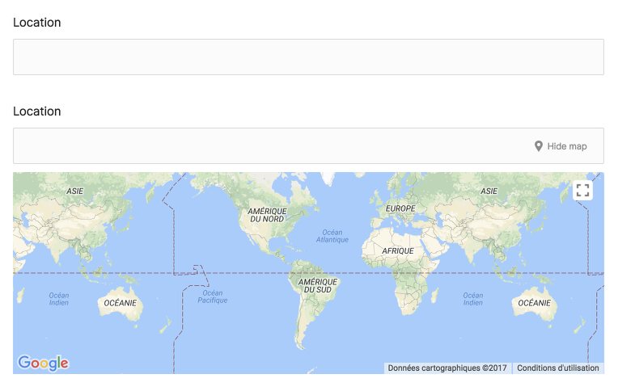
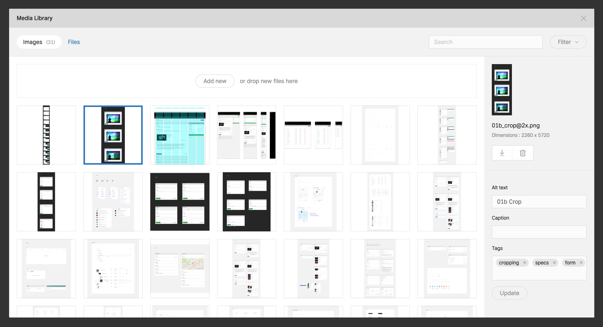

# AREA 17 CMS Toolkit

## Introduction

The CMS Toolkit is a Laravel Composer package to rapidly create and deploy a completely custom admin area for our clients websites that is highly functional, beautiful and easy to use.
It's a curation of all the features that were developed on custom admin areas since our switch to Laravel in 2014. The architecture, conventions and helpers it provides currently powers the [Opéra National de Paris 2015 website redesign](https://www.operadeparis.fr/), the [AREA 17 2016 website redesign](https://area17.com) and the [THG 2016 redesign website](https://www.thg-paris.com/). Initially released in December 2016, this Laravel package is powering the [Roto](https://roto.com), [Mai 36](https://mai36.com) and [Pentagram](https://www.pentagram.com) 2017 redesigns, as well as the [Artists at Risk Connection](https://artistsatriskconnection.org) platform.

By default, with very little developer actions, it provides:
- a beautiful admin interface that really focuses on the editors needs, using AREA 17's custom built Vue.js components
- user authentication, authorization and management
- rapid searching and editing of content for editors with various tools:
  - search / multi-filtering / sort
  - quick publish / feature / reorder / edit / delete
  - input, textarea, rich textarea form fields with optional SEO optimized limits
  - date pickers for publication timeframe
  - select, multi-select, content type browser for related content and tags
  - image selector with cropping
  - form repeaters
  - flexible content block editor (composable blocks from Vue components)
  - translated fields with independent publication status
  - slugs management with automatic redirect of old urls
  - content versioning with preview and side by side comparison of fully rendered frontend site
- intuitive content featuring using a bucket UI
- a media library:
  - with S3 or local storage
  - powered by Imgix rendering for on the fly resizing, cropping and compression of responsive images
  - easily extendable to support other storage and/or rendering providers (ie. Cloudinary, IIIF, ...)
- a file library:
  - with S3 or local storage
  - easily extendable to support other storage providers
  - can be used to attach and serve pdfs or videos in any content type
- the ability to art direct responsive images through:
  - different manual cropping ratio for each breakpoints
  - automatic entropy or faces cropping with no manual input
- rapid new content types creation/edition/maintenance for developers (generators and conventions for unified CRUD features)
- development and production ready toolset (debug bar, inspector, exceptions handler)
- static templates automatic routing (ie: adding a blade file at a certain location will be automatically available at the same url of its filename, no need to deal with application code, nice for frontend devs or simple page needs)

In development, you can use it in any Laravel environment like [Valet](https://laravel.com/docs/5.3/valet) or [Homestead](https://laravel.com/docs/5.3/homestead), though in a client's project context, you would ideally run your application in a custom virtual machine or Docker environment that is as close as possible as your production environment (either through a custom `after.sh` config for Homestead, an Ansible provisionned Vagrant box or a Docker Compose project).

## Install

This is a private package hosted on [code.area17.com](https://code.area17.com) for now, so you need to add the following to your `composer.json` file before installing:

```json
"repositories": [
    {
        "type": "git",
        "url": "git@code.area17.com:a17/laravel-cms-toolkit.git"
    }
],
```

Then you should be able to run:

```bash
composer require a17/laravel-cms-toolkit
```
Add the CMS Toolkit Install service provider in `config/app.php` (before Application Service Providers):

```php
<?php

'providers' => [
    ...
    A17\CmsToolkit\CmsToolkitInstallServiceProvider::class,
];
```

Setup your `.env` file:

```bash
# APP_URL without scheme so that the package can resolve admin.APP_URL automatically
# Your computer should be able to resolve both APP_URL and admin.APP_URL
# For example, with a vagrant vm you should add to your /etc/hosts file:
# 192.168.10.10 APP_URL
# 192.168.10.10 admin.APP_URL
APP_URL=client.dev.a17.io 

MAIL_DRIVER=log # so that until you configure it, welcome and reset emails will go to your logs

# if you use S3 uploads, you'll need those credentials
#AWS_KEY=client_aws_key
#AWS_SECRET=client_aws_secret
#AWS_BUCKET=client_bucket
AWS_USE_HTTPS=true

FILE_LIBRARY_CASCADE_DELETE=true
MEDIA_LIBRARY_CASCADE_DELETE=true

# if you use Imgix, you'll need the source url
#IMGIX_SOURCE_HOST=client.imgix.net
IMGIX_USE_SIGNED_URLS=false
IMGIX_USE_HTTPS=true

BLOCK_EDITOR_SHOW_ERRORS=true
```

Run the install command

```bash
php artisan cms-toolkit:install
```

Run the setup command (it will migrate your database schema so run it where your database is accessible, ie. in vagrant)

```bash
php artisan cms-toolkit:setup
```

Setup your list of available languages for translated fields in `config/translatable.php` (without nested locales).

```php
<?php

return [
    'locales' => [
        'en',
        'fr',
    ],
```

Use a single locale code if you're not using model translations in your project.

Next, let's setup the CMS frontend toolset composed of NPM scripts and a Laravel Mix configuration.

Add the following dev dependencies to your project's `package.json`:

```json
"devDependencies": {
  "cross-env": "^5.1",
  "laravel-mix": "^1.0",
  "watch": "^1.0.2",
  "concurrently": "^3.5.0"
}
```

Add the following npm scripts to your project's `package.json`:

```json
"scripts": {
  "cms-dev": "npm run cms-copy-blocks && concurrently \"cd vendor/a17/laravel-cms-toolkit && npm install --no-save && npm run hot\" \"npm run cms-watch\" && npm run cms-clean-blocks",
  "cms-watch": "concurrently \"watch 'npm run cms-development' vendor/a17/laravel-cms-toolkit/public --wait=2 --interval=0.1\" \"npm run cms-watch-blocks\"",
  "cms-development": "cross-env NODE_ENV=development node_modules/webpack/bin/webpack.js --progress --hide-modules --config=node_modules/laravel-mix/setup/webpack.config.js",
  "cms-prod": "npm run cms-copy-blocks && cd vendor/a17/laravel-cms-toolkit && npm install --no-save && npm run prod && cd ../../.. && npm run cms-production && npm run cms-clean-blocks",
  "cms-production": "cross-env NODE_ENV=production node_modules/webpack/bin/webpack.js --no-progress --hide-modules --config=node_modules/laravel-mix/setup/webpack.config.js",
  "cms-copy-blocks": "mkdir -p resources/assets/js/blocks/ && mkdir -p vendor/a17/laravel-cms-toolkit/frontend/js/components/blocks/customs/ && cp -R resources/assets/js/blocks/ vendor/a17/laravel-cms-toolkit/frontend/js/components/blocks/customs/",
  "cms-clean-blocks": "rm -rf vendor/a17/laravel-cms-toolkit/frontend/js/components/blocks/customs/*",
  "cms-watch-blocks": "watch 'npm run cms-copy-blocks' resources/assets/js/blocks --wait=2 --interval=0.1"
}
```

Add or modify your project's `wepback.mix.js` file with the following content:

```
let mix = require('laravel-mix');

if (mix.inProduction()) {
  mix.copyDirectory('vendor/a17/laravel-cms-toolkit/public/assets/vendor', 'public/assets/vendor');
  mix.copyDirectory('vendor/a17/laravel-cms-toolkit/public/assets/admin/fonts', 'public/assets/admin/fonts');
  mix.copy('vendor/a17/laravel-cms-toolkit/public/assets/admin/icons/icons.svg', 'public/assets/admin/icons/icons.svg');
  mix.copy('vendor/a17/laravel-cms-toolkit/public/assets/admin/icons/icons-files.svg', 'public/assets/admin/icons/icons-files.svg');
  mix.copy('vendor/a17/laravel-cms-toolkit/public/assets/admin/css/app.css', 'public/assets/admin/css/app.css');
  mix.copy('vendor/a17/laravel-cms-toolkit/public/assets/admin/js/main-dashboard.js', 'public/assets/admin/js/main-dashboard.js');
  mix.copy('vendor/a17/laravel-cms-toolkit/public/assets/admin/js/main-listing.js', 'public/assets/admin/js/main-listing.js');
  mix.copy('vendor/a17/laravel-cms-toolkit/public/assets/admin/js/main-form.js', 'public/assets/admin/js/main-form.js');
  mix.copy('vendor/a17/laravel-cms-toolkit/public/assets/admin/js/main-buckets.js', 'public/assets/admin/js/main-buckets.js');
  mix.copy('vendor/a17/laravel-cms-toolkit/public/assets/admin/js/manifest.js', 'public/assets/admin/js/manifest.js');
  mix.copy('vendor/a17/laravel-cms-toolkit/public/assets/admin/js/vendor.js', 'public/assets/admin/js/vendor.js');
  mix.version();
} else {
  mix.copyDirectory('vendor/a17/laravel-cms-toolkit/public', 'public');
}
```

Finally, add the following to your project `.gitignore`:
```
public/assets/admin
public/assets/vendor
public/mix-manifest.json
public/hot
```

You'll want to run `npm run cms-dev` to start working locally and `npm run cms-prod` to build for production.

That's about it!

## Usage

### Static templates
Frontenders, you might often be the first users of this package in new Laravel apps when starting to work on static templates.

Creating Blade files in `views/templates` will make them directly accessible at `admin.domain.dev/templates/file-name`.

Feel free to use all [Blade](https://laravel.com/docs/5.3/blade) features, extend a parent layout and cut out your views in partials, this will help a lot during integration.

Frontend assets should live in the `public/dist` folder along with a `rev-manifest.json` for compiled assets in production. Using the [A17 FE Boilerplate](https://code.area17.com/a17/fe-boilerplate) should handle that for you.

Use the `revAsset('asset.{css|js})` helper in your templates to get assets URLs in any environment.

Use the `icon('icon-name', [])` helper to display an icon from the SVG sprite. The second parameter is an array of options. It currently understand `title`, `role` and `css_class`.


### Configuration
#### Options

By default, you shouldn't have to modify anything if you want to use the default config which is basically:
- users management
- media library on S3 with Imgix
- file library on S3

The only thing you would have to do is setting up the necessary environment variables in your `.env` file.

You can override any of these configurations values independendtly from the empty `config/cms-toolkit.php` file that was published in your app when you ran the `cms-toolkit:install` command.

```php
<?php

return [

    /*
    |--------------------------------------------------------------------------
    | Application Namespace
    |--------------------------------------------------------------------------
    |
    | This value is the namespace of your application.
    |
     */
    'namespace' => 'App',

    /*
    |--------------------------------------------------------------------------
    | Application Admin URL
    |--------------------------------------------------------------------------
    |
    | This value is the URL of your admin application.
    |
     */
    'admin_app_url' => env('ADMIN_APP_URL', 'admin.' . env('APP_URL')),

    /*
    |--------------------------------------------------------------------------
    | CMS Toolkit Enabled Features
    |--------------------------------------------------------------------------
    |
    | This array allows you to enable/disable the CMS Toolkit default features.
    |
     */
    'enabled' => [
        'users-management' => true,
        'media-library' => true,
        'file-library' => true,
        'buckets' => false,
        'users-image' => false,
        'site-link' => false,
        'settings' => false,
        'google-login' => false,
    ],

    /*
    |--------------------------------------------------------------------------
    | CMS Toolkit Auth configuration
    |--------------------------------------------------------------------------
    |
    | Right now this only allows you to redefine the
    | default login redirect path.
    |
     */
    'auth_login_redirect_path' => '/',

    /*
    |--------------------------------------------------------------------------
    | CMS Toolkit Media Library configuration
    |--------------------------------------------------------------------------
    |
    | This array allows you to provide the package with your configuration
    | for the media library disk, endpoint type and others options depending
    | on your endpoint type.
    |
    | Supported endpoint types: 'local' and 's3'.
    | Set cascade_delete to true to delete files on the storage too when
    | deleting from the media library.
    | If using the 'local' endpoint type, define a 'local_path' to store files.
    | Supported image service: 'A17\CmsToolkit\Services\MediaLibrary\Imgix'
    |
     */
    'media_library' => [
        'disk' => 'libraries',
        'endpoint_type' => env('MEDIA_LIBRARY_ENDPOINT_TYPE', 's3'),
        'cascade_delete' => env('MEDIA_LIBRARY_CASCADE_DELETE', false),
        'local_path' => env('MEDIA_LIBRARY_LOCAL_PATH'),
        'image_service' => 'A17\CmsToolkit\Services\MediaLibrary\Imgix',
        'acl' => env('MEDIA_LIBRARY_ACL', 'private'),
        'filesize_limit' => env('MEDIA_LIBRARY_FILESIZE_LIMIT', 50),
    ],

    /*
    |--------------------------------------------------------------------------
    | CMS Toolkit Imgix configuration
    |--------------------------------------------------------------------------
    |
    | This array allows you to provide the package with your configuration
    | for the Imgix image service.
    |
     */
    'imgix' => [
        'source_host' => env('IMGIX_SOURCE_HOST'),
        'use_https' => env('IMGIX_USE_HTTPS', true),
        'use_signed_urls' => env('IMGIX_USE_SIGNED_URLS', false),
        'sign_key' => env('IMGIX_SIGN_KEY'),
        'default_params' => [
            'fm' => 'jpg',
            'q' => '80',
            'auto' => 'compress,format',
            'fit' => 'min',
        ],
        'lqip_default_params' => [
            'fm' => 'gif',
            'auto' => 'compress',
            'blur' => 100,
            'dpr' => 1,
        ],
        'social_default_params' => [
            'fm' => 'jpg',
            'w' => 900,
            'h' => 470,
            'fit' => 'crop',
            'crop' => 'entropy',
        ],
        'cms_default_params' => [
            'q' => 60,
            'dpr' => 1,
        ],
    ],

    /*
    |--------------------------------------------------------------------------
    | CMS Toolkit File Library configuration
    |--------------------------------------------------------------------------
    |
    | This array allows you to provide the package with your configuration
    | for the file library disk, endpoint type and others options depending
    | on your endpoint type.
    |
    | Supported endpoint types: 'local' and 's3'.
    | Set cascade_delete to true to delete files on the storage too when
    | deleting from the file library.
    | If using the 'local' endpoint type, define a 'local_path' to store files.
    |
     */
    'file_library' => [
      'disk' => 'libraries',
      'endpoint_type' => env('FILE_LIBRARY_ENDPOINT_TYPE', 's3'),
      'cascade_delete' => env('FILE_LIBRARY_CASCADE_DELETE', false),
      'local_path' => env('FILE_LIBRARY_LOCAL_PATH'),
      'acl' => env('FILE_LIBRARY_ACL', 'public-read'),
      'filesize_limit' => env('FILE_LIBRARY_FILESIZE_LIMIT', 50),
    ],

    /*
    |--------------------------------------------------------------------------
    | CMS Toolkit Block Editor configuration
    |--------------------------------------------------------------------------
    |
    | This array allows you to provide the package with your configuration
    | for the Block Editor form field.
    | More to come here...
    |
     */
    'block_editor' => [
        'render_views_namespace' => 'site.blocks'
        'use_iframes' => true,
        'iframe_wrapper_view' => '',
        'show_render_errors' => env('BLOCK_EDITOR_SHOW_ERRORS', false),

    ],

    /*
    |--------------------------------------------------------------------------
    | CMS Toolkit SEO configuration
    |--------------------------------------------------------------------------
    |
    | This array allows you to provide the package with some SEO configuration
    | for the frontend site controller helper and image service.
    |
     */
    'seo' => [
        'site_title' => config('app.name'),
        'site_desc' => config('app.name'),
        'image_default_id' => env('SEO_IMAGE_DEFAULT_ID'),
        'image_local_fallback' => env('SEO_IMAGE_LOCAL_FALLBACK'),
    ],

    /*
    |--------------------------------------------------------------------------
    | CMS Toolkit Developer configuration
    |--------------------------------------------------------------------------
    |
    | This array allows you to enable/disable debug tool and configurations.
    |
     */
    'debug' => [
        'use_whoops' => env('DEBUG_USE_WHOOPS', true),
        'whoops_path_guest' => env('WHOOPS_GUEST_PATH'),
        'whoops_path_host' => env('WHOOPS_HOST_PATH'),
        'use_inspector' => env('DEBUG_USE_INSPECTOR', false),
        'debug_bar_in_fe' => env('DEBUG_BAR_IN_FE', false),
    ],

    /*
    |--------------------------------------------------------------------------
    | CMS Toolkit Frontend assets configuration
    |--------------------------------------------------------------------------
    |
    | This allows you to setup frontend helpers related settings.
    |
    |
     */
    'frontend' => [
        'rev_manifest_path' => public_path('dist/rev-manifest.json'),
        'dev_assets_path' => '/dev',
        'dist_assets_path' => '/dist',
        'svg_sprites_path' => 'sprites.svg', // relative to dev/dist assets paths
        'svg_sprites_use_hash_only' => true,
        'views_path' => 'site',
        'home_route_name' => 'home',
    ],
];

```


#### Navigation

This file manages the navigation of your admin area. Using the CMS UI, the package provides 2 levels of navigation: global and primaryy. This file simply contains a nested array description of your navigation.

Each entry is defined by multiple options.
The simplest entry has a `title` and a `route` option which is a Laravel route name. A global entry can define a `primary_navigation` array that will contains more entries.

Two other options are provided that are really useful in conjunction with the CRUD modules you'll create in your application: `module` and `can`. `module` is a boolean to indicate if the entry is routing to a module route. By default it will link to the index route of the module you used as your entry key. `can` allows you to display/hide navigation links depending on the current user and permission name you specify.

Example:

```php
<?php

return [
    'dashboard' => [
        'title' => 'Dashboard',
        'route' => 'admin.dashboard',
    ],
    'work' => [
        'title' => 'Work',
        'route' => 'admin.work.projects.index',
        'primary_navigation' => [
            'projects' => [
                'title' => 'Projects',
                'module' => true,
            ],
            'clients' => [
                'title' => 'Clients',
                'module' => true,
            ],
            'industries' => [
                'title' => 'Industries',
                'module' => true,
            ],
            'studios' => [
                'title' => 'Studios',
                'module' => true,
            ],
        ],
    ],
];
```

To make it work properly and to get active states automatically, you should structure your routes in the same way using for example here:

```php
<?php

Route::get('/dashboard')->...->name('admin.dashboard');
Route::group(['prefix' => 'work'], function () {
    Route::module('projects');
    Route::module('clients');
    Route::module('industries');
    Route::module('studios');
});
```

### CRUD Modules
#### CLI Generator
You can generate all the files needed for a new CRUD using the generator:

```bash
php artisan cms-toolkit:module yourPluralModuleName
```

The command has a couple of options :
- `--hasBlocks (-B)`,
- `--hasTranslation (-T)`,
- `--hasSlug (-S)`,
- `--hasMedias (-M)`,
- `--hasFiles (-F)`,
- `--hasPosition (-P)`
- `--hasRevisions(-R)`.

It will generate a migration file, a model, a repository, a controller, a form request object and a form view.

Start by filling in the migration and models.

Add `Route::module('yourPluralModuleName}');` to your admin routes file.

Setup a new CMS menu item in `config/cms-navigation.php`.

Setup your index options and columns in your controller.

Setup your form fields in `resources/views/admin/moduleName/form.blade.php`.

Enjoy.

#### Routes

A router macro is available to create module routes quicker:
```php
<?php

Route::module('yourModulePluralName');

// You can add an array of only/except action names as a second parameter
// By default, the following routes are created : 'reorder', 'publish', 'browser', 'bucket', 'feature', 'restore', 'bulkFeature', 'bulkPublish', 'bulkDelete', 'bulkRestore'
Route::module('yourModulePluralName', ['except' => ['reorder', 'feature', 'bucket', 'browser']])

// You can add an array of only/except action names for the resource controller as a third parameter
// By default, the following routes are created : 'index', 'store', 'show', 'edit', 'update', 'destroy'
Route::module('yourModulePluralName', [], ['only' => ['index', 'edit', 'store', 'destroy']])

// The last optional parameter disable the resource controller actions on the module
Route::module('yourPluralModuleName', [], [], false)
```

#### Migrations
Migrations are regular Laravel migrations. A few helpers are available to create the default fields any CRUD module will use:

```php
<?php

// main table, holds all non translated fields
Schema::create('table_name_plural', function (Blueprint $table) {
    createDefaultTableFields($table)
    // will add the following inscructions to your migration file
    // $table->increments('id');
    // $table->softDeletes();
    // $table->timestamps();
    // $table->boolean('published');
});

// translation table, holds translated fields
Schema::create('table_name_singular_translations', function (Blueprint $table) {
    createDefaultTranslationsTableFields($table, 'tableNameSingular')
    // will add the following inscructions to your migration file
    // createDefaultTableFields($table);
    // $table->string('locale', 6)->index();
    // $table->boolean('active');
    // $table->integer("{$tableNameSingular}_id")->unsigned();
    // $table->foreign("{$tableNameSingular}_id", "fk_{$tableNameSingular}_translations_{$tableNameSingular}_id")->references('id')->on($table)->onDelete('CASCADE');
    // $table->unique(["{$tableNameSingular}_id", 'locale']);
});

// slugs table, holds slugs history
Schema::create('table_name_singular_slugs', function (Blueprint $table) {
    createDefaultSlugsTableFields($table, 'tableNameSingular')
    // will add the following inscructions to your migration file
    // createDefaultTableFields($table);
    // $table->string('slug');
    // $table->string('locale', 6)->index();
    // $table->boolean('active');
    // $table->integer("{$tableNameSingular}_id")->unsigned();
    // $table->foreign("{$tableNameSingular}_id", "fk_{$tableNameSingular}_translations_{$tableNameSingular}_id")->references('id')->on($table)->onDelete('CASCADE')->onUpdate('NO ACTION');
});

// revisions table, holds revision history
Schema::create('table_name_singular_revisions', function (Blueprint $table) {
    createDefaultRevisionTableFields($table, 'tableNameSingular');
    // will add the following inscructions to your migration file
    // $table->increments('id');
    // $table->timestamps();
    // $table->json('payload');
    // $table->integer("{$tableNameSingular}_id")->unsigned()->index();
    // $table->integer('user_id')->unsigned()->nullable();
    // $table->foreign("{$tableNameSingular}_id")->references('id')->on("{$tableNamePlural}")->onDelete('cascade');
    // $table->foreign('user_id')->references('id')->on('users')->onDelete('set null');
});

// related content table, holds many to many association between 2 tables
Schema::create('table_name_singular1_table_name_singular2', function (Blueprint $table) {
    createDefaultRelationshipTableFields($table, $table1NameSingular, $table2NameSingular)
    // will add the following inscructions to your migration file 
    // $table->integer("{$table1NameSingular}_id")->unsigned();
    // $table->foreign("{$table1NameSingular}_id")->references('id')->on($table1NamePlural)->onDelete('cascade');
    // $table->integer("{$table2NameSingular}_id")->unsigned();
    // $table->foreign("{$table2NameSingular}_id")->references('id')->on($table2NamePlural)->onDelete('cascade');
    // $table->index(["{$table2NameSingular}_id", "{$table1NameSingular}_id"]);
});
```

A few CRUD controllers require that your model have a field in the database with a specific name: `published` and `position`, so stick with those column names if you are going to use publication status and sortable listings.


#### Models

Set your fillables to prevent mass-assignement. Very important as we use `request()->all()` in the module controller.


For fields that should always be saved as null in the database when not sent by the form, use the `nullable` array.

For fields that should always be saved to false in the database when not sent by the form, use the `checkboxes` array.

Depending on the features you need on your model, include the availables traits and configure their respective options:

- HasPosition: implement the `A17\CmsToolkit\Models\Behaviors\Sortable` interface and add a position field to your fillables.

- HasTranslation: add translated fields in the `translatedAttributes` array and in the `fillable` array of the generated translatable model in `App/Models/Translations` (always keep the active and locale fields).

- HasSlug: specify the field(s) that is going to be used to create the slug in the `slugAttributes` array

- HasMedias: add the `mediasParams` configuration array:

```php
<?php

public $mediasParams = [
    'cover' => [ // role name
        'default' => [ // crop name
            [
                'name' => 'default', // ratio name, same as crop name if single
                'ratio' => 16 / 9, // ratio as a fraction or number
            ],
        ],
        'mobile' => [
            [
                'name' => 'landscape', // ratio name, multiple allowed
                'ratio' => 16 / 9, 
            ],
            [
                'name' => 'portrait', // ratio name, multiple allowed
                'ratio' => 3 / 4,
            ],
        ],
    ],
    '...' => [ // another role
        ... // with crops
    ]
];
```

- HasFiles: add the `filesParams` configuration array

```php
<?php

public $filesParams = ['project_pdf']; // a list of file roles
```

- HasRevisions: no options

#### Controllers

```php
<?php

    protected $moduleName = 'yourModuleName';
    
    /*
     * Options of the index view
     */
    protected $indexOptions = [
        'create' => true,
        'publish' => true,
        'bulkPublish' => true,
        'feature' => false,
        'bulkFeature' => false,
        'restore' => true,
        'bulkRestore' => true,
        'bulkDelete' => true,
        'reorder' => false,
        'permalink' => true,
    ];

    /*
     * Key of the index column to use as title/name/anythingelse column
     * This will be the first column in the listing and will have a link to the form
     */
    protected $titleColumnKey = 'title';
    
    /*
     * Available columns of the index view
     */
    protected $indexColumns = [
        'image' => [
            'thumb' => true, // image column
            'variant' => [
                'role' => 'cover',
                'crop' => 'default',
            ],
        ],
        'title' => [ // field column
            'title' => 'Title',
            'field' => 'title',
        ],
        'subtitle' => [
            'title' => 'Subtitle',
            'field' => 'subtitle',
            'sort' => true, // column is sortable
            'visible' => false, // will be available from the columns settings dropdown
        ],
        'relationName' => [ // relation column
            'title' => 'Relation name',
            'sort' => true,
            'relationship' => 'relationName',
            'field' => 'relationFieldToDisplay'
        ],
        'presenterMethodField' => [ // presenter column
            'title' => 'Field title',
            'field' => 'presenterMethod',
            'present' => true,
        ]
    ];

    /*
     * Columns of the browser view for this module when browsed from another module
     * using a browser form field
     */
    protected $browserColumns = [
        'title' => [
            'title' => 'Title',
            'field' => 'title',
        ],
    ];

    /*
     * Relations to eager load for the index view
     */
    protected $indexWith = [];

    /*
     * Relations to eager load for the form view
     * Add relationship used in multiselect and resource form fields
     */
    protected $formWith = [];

    /*
     * Relation count to eager load for the form view
     */
    protected $formWithCount = [];

    /*
     * Filters mapping ('fFilterName' => 'filterColumn')
     * You can associate items list to filters by having a fFilterNameList key in the indexData array
     * For example, 'fCategory' => 'category_id' and 'fCategoryList' => app(CategoryRepository::class)->listAll()
     */
    protected $filters = [];

    /*
     * Add anything you would like to have available in your module's index view
     */
    protected function indexData($request)
    {
        return [];
    }

    /*
     * Add anything you would like to have available in your module's form view
     * For example, relationship lists for multiselect form fields
     */
    protected function formData($request)
    {
        return [];
    }

    // Optional, if the automatic way is not working for you (default is ucfirst(str_singular($moduleName)))
    protected $modelName = 'model';

    // Optional, to specify a different feature field name than the default 'featured'
    protected $featureField = 'featured';

    // Optional, specify number of items per page in the listing view (-1 to disable pagination)
    protected $perPage = 20;

    // Optional, specify the default listing order
    protected $defaultOrders = ['title' => 'asc'];

    // Optional, specify the default listing filters
    protected $defaultFilters = ['search' => 'title|search'];
```

You can also override all actions and internal functions, checkout the ModuleController source in `A17\CmsToolkit\Http\Controllers\Admin\ModuleController`.

#### Form Requests
Classic Laravel 5 [form request validation](https://laravel.com/docs/5.5/validation#form-request-validation).

There is an helper to define rules for translated fields without having to deal with each locales:

```php
<?php

$this->rulesForTranslatedFields([
 // regular rules
], [
  // translated fields rules with just the field name like regular rules
]);
```

There is also an helper to define validation messages for translated fields:

```php
<?php

$this->messagesForTranslatedFields([
 // regular messages
], [
  // translated fields messages
]);
```


#### Repositories

Depending on the model feature, include one or multiple of those traits: `HandleTranslations`, `HandleSlugs`, `HandleMedias`, `HandleFiles`, `HandleRevisions`.

Repositories allows you to modify the default behavior of your models by providing some entry points in the form of methods that you might implement:

- for filtering:

```php
<?php

// implement the filter method
public function filter($query, array $scopes = []) {

    // and use the following helpers

    // add a where like clause
    $this->addLikeFilterScope($query, $scopes, 'field_in_scope');

    // add orWhereHas clauses
    $this->searchIn($query, $scopes, 'field_in_scope', ['field1', 'field2', 'field3']);

    // add a whereHas clause
    $this->addRelationFilterScope($query, $scopes, 'field_in_scope', 'relationName');

    // or just go manually with the $query object
    if (isset($scopes['field_in_scope'])) {
      $query->orWhereHas('relationName', function ($query) use ($scopes) {
          $query->where('field', 'like', '%' . $scopes['field_in_scope'] . '%');
      });
    }

    // don't forget to call the parent filter function
    return parent::filter($query, $scopes);
}
```

- for custom ordering:

```php
<?php

// implement the order method
public function order($query, array $orders = []) {
    // don't forget to call the parent order function
    return parent::order($query, $orders);
}
```

- for custom form fieds

```php
<?php

// implement the getFormFields method
public function getFormFields($object) {
    // don't forget to call the parent getFormFields function
    $fields = parent::getFormFields($object);

    // get oneToMany relationship for select multiple input
    $fields = $this->getFormFieldsForMultiSelect($fields, 'relationName');

    // get fields for a repeater
    $fields['externalLinks'] = $this->getFormFieldsForRepeater($object, 'externalLinks');

    // return fields
    return $fields
}

```

- for custom field preparation before create action


```php
<?php

// implement the prepareFieldsBeforeCreate method
public function prepareFieldsBeforeCreate($fields) {
    // don't forget to call the parent prepareFieldsBeforeCreate function
    return parent::prepareFieldsBeforeCreate($fields);
}

```

- for custom field preparation before save action


```php
<?php

// implement the prepareFieldsBeforeSave method
public function prepareFieldsBeforeSave($object, $fields) {
    // don't forget to call the parent prepareFieldsBeforeSave function
    return parent:: prepareFieldsBeforeSave($object, $fields);
}

```

- for after save actions (like attaching a relationship)

```php
<?php

// implement the afterSave method
public function afterSave($object, $fields) {
    // for exemple, to sync a many to many relationship
    // $object->relationName()->sync($fields['relationName'] ?? []);
    // or, to save a oneToMany relationship
    // $this->updateOneToMany($object, $fields, 'relationName', 'formFieldName', 'relationAttribute')
    // or, to save a belongToMany relationship used with the browser field
    $this->updateOrderedBelongsTomany($object, $fields, 'people');
    // or, to save a belongToMany relationship used with the repeater field
    $this->updateRepeaterMany($object, $fields, 'externalLinks', false);
    // or, to save a hasMany relationship used with the repeater field
    $this->updateRepeater($object, $fields, 'partnerVideos');
    parent::afterSave($object, $fields);}

```

- for hydrating the model for preview of revisions

```php
<?php

// implement the hydrate method
public function hydrate($object, $fields)
{
    // for exemple, to hydrate a belongToMany relationship used with the browser field
    $this->hydrateOrderedBelongsTomany($object, $fields, 'people');
    return parent::hydrate($object, $fields);
}
```

#### Form fields

Wrap them into the following in your module `form` view (`resources/views/admin/moduleName/form.blade.php`):

```php
@extends('cms-toolkit::layouts.form')
@section('contentFields')
    @formField('...', [...])
    ...
@stop
```

The idea of the `contentFields` section is to contain the most important fields and the block editor as the last field.

If you have attributes, relationships, extra images, file attachments or repeaters, you'll want to add a `fieldsets` section after the `contentFields` section and use the `a17-fieldset` Vue component to create new ones like in the following example:

```php
@extends('cms-toolkit::layouts.form')

@section('contentFields')
    @formField('...', [...])
    ...
@stop

@section('fieldsets')
    @formField('...', [...])
    ...
@stop
```

##### Input
>

```php
@formField('input', [
    'name' => 'subtitle',
    'label' => 'Subtitle',
    'maxlength' => 100,
    'required' => true,
    'note' => 'Hint message goes here',
    'placeholder' => 'Placeholder goes here',
])

@formField('input', [
    'translated' => true,
    'name' => 'subtitle_translated',
    'label' => 'Subtitle (translated)',
    'maxlength' => 250,
    'required' => true,
    'note' => 'Hint message goes here',
    'placeholder' => 'Placeholder goes here',
    'type' => 'textarea',
    'rows' => 3
])
```

##### WYSIWYG
>

```php
@formField('wysiwyg', [
    'name' => 'case_study',
    'label' => 'Case study text',
    'toolbarOptions' => ['list-ordered', 'list-unordered'],
    'placeholder' => 'Case study text',
    'maxlength' => 200,
    'note' => 'Hint message',
])

@formField('wysiwyg', [
    'translated' => true,
    'name' => 'case_study_translated',
    'label' => 'Case study text (translated)',
    'placeholder' => 'Case study text (translated)',
    'customOptions' => [
        'modules' => [
            'toolbar' => ['bold', 'clean']
        ]
    ],
])
```

##### Medias
>

```php
@formField('medias', [
    'name' => 'cover',
    'label' => 'Cover image',
    'note' => 'Minimum image width 1300px'
])

@formField('medias', [
    'name' => 'slideshow',
    'label' => 'Slideshow',
    'max' => 5,
    'note' => 'Minimum image width: 1500px'
])
```

##### Datepicker
>

```php
@formField('date_picker', [
    'name' => 'event_date',
    'label' => 'Event date',
    'minDate' => '2017-09-10 12:00',
    'maxDate' => '2017-12-10 12:00'
])
```

##### Select
>

```php
@formField('select', [
    'name' => 'office',
    'label' => 'Office',
    'placeholder' => 'Select an office',
    'options' => [
        [
            'value' => 1,
            'label' => 'New York'
        ],
        [
            'value' => 2,
            'label' => 'London'
        ],
        [
            'value' => 3,
            'label' => 'Berlin'
        ]
    ]
])
```

##### Select unpacked
>

```php
@formField('select', [
    'name' => 'discipline',
    'label' => 'Discipline',
    'unpack' => true,
    'options' => [
        [
            'value' => 'arts',
            'label' => 'Arts & Culture'
        ],
        [
            'value' => 'finance',
            'label' => 'Banking & Finance'
        ],
        [
            'value' => 'civic',
            'label' => 'Civic & Public'
        ],
        [
            'value' => 'design',
            'label' => 'Design & Architecture'
        ],
        [
            'value' => 'education',
            'label' => 'Education'
        ],
        [
            'value' => 'entertainment',
            'label' => 'Entertainment'
        ],
    ]
])
```

##### Multi select
>

```php
@formField('multi_select', [
    'name' => 'sectors',
    'label' => 'Sectors',
    'options' => [
        [
            'value' => 'arts',
            'label' => 'Arts & Culture'
        ],
        [
            'value' => 'finance',
            'label' => 'Banking & Finance'
        ],
        [
            'value' => 'civic',
            'label' => 'Civic & Public'
        ],
        [
            'value' => 'design',
            'label' => 'Design & Architecture'
        ],
        [
            'value' => 'education',
            'label' => 'Education'
        ]
    ]
])

@formField('multi_select', [
    'name' => 'sectors_bis',
    'label' => 'Sectors bis',
    'min' => 1,
    'max' => 2,
    'options' => [
        [
            'value' => 'arts',
            'label' => 'Arts & Culture'
        ],
        [
            'value' => 'finance',
            'label' => 'Banking & Finance'
        ],
        [
            'value' => 'civic',
            'label' => 'Civic & Public'
        ],
        [
            'value' => 'design',
            'label' => 'Design & Architecture'
        ],
        [
            'value' => 'education',
            'label' => 'Education'
        ],
        [
            'value' => 'entertainment',
            'label' => 'Entertainment'
        ],
    ]
])
```

##### Block editor
>

```php
@formField('block_editor', [
    'blocks' => ['title', 'quote', 'text', 'image', 'grid', 'test', 'publications', 'news']
])
```

##### Repeater
>

```php
<a17-fieldset title="Videos" id="videos" :open="true">
    @formField('repeater', ['type' => 'video'])
</a17-fieldset>
```

##### Browser
>

```php
<a17-fieldset title="Related" id="related" :open="true">
    @formField('browser', [
        'label' => 'Publications',
        'max' => 4,
        'name' => 'publications',
        'endpoint' => 'http://admin.cms-sandbox.dev.a17.io/content/posts/browser'
    ])
</a17-fieldset>
```

##### Files
>

```php
@formField('files', [
    'name' => 'single_file',
    'label' => 'Single file',
    'note' => 'Add one file (per language)'
])

@formField('files', [
    'name' => 'single_file_no_translate',
    'label' => 'Single file (no translate)',
    'note' => 'Add one file',
    'noTranslate' => true,
])

@formField('files', [
    'name' => 'files',
    'label' => 'Files',
    'noTranslate' => true,
    'max' => 4,
])
```

##### Map
>

```php
@formField('map', [
    'name' => 'location',
    'label' => 'Location',
    'showMap' => false,
])

@formField('map', [
    'name' => 'location_3',
    'label' => 'Location',
])
```

##### Color
>

```php
@formField('color', [
    'name' => 'main-color',
    'label' => 'Main color'
])
```

### Block editor

#### Creating blocks
In progress.

#### Using blocks
First, make sure your project have the blocks table migration. If not, you can find the `create_blocks_table` migration in the toolkit's source in `migrations`.

Add the corresponding traits to your model and repository, respectively `HasBlocks` and `HandleBlocks`.

In your module's form view, use the `block_editor` form field. If you want to restrict the list of blocks available for this specific module, pass a `blocks` array with a list of block names as defined in your `cms-toolkit` configuration file.


#### Rendering blocks
As long as you have access to a model instance that uses the HasBlocks trait in a view, you can call the `renderBlocks` helper on it to render the list of blocks that were created from the CMS. By default, this function will loop over all the blocks and their child blocks and render a Blade view located in `resources/views/site/blocks` with the same name as the block key you specified in your CMS toolkit configuration and module form. 

In the frontend templates, you can call the `renderBlocks` helper like this:

```php
{!! $item->renderBlocks() !!}
```

If you need to swap out a block view for a specific module (let’s say you used the same block in 2 modules of the CMS but need different rendering), you can do the following:

```php
{!! $work->renderBlocks([
  'block-type' => 'view.path',
  'block-type-2' => 'another.view.path'
]) !!}
```

In those Blade view, you will have access to a `$block`variable with a couple of helper function available to retrieve the block content:

```php
{{ $block->input('inputNameYouSpecifiedInTheBlockFormField') }}
{{ $block->translatedinput('inputNameYouSpecifiedInATranslatedBlockFormField') }}
```

If the block has a media field, you can refer to the Media Library documentation below to learn about the `HasMedias` trait helpers.
To give an exemple:

```php
{{ $block->image('mediaFieldName', 'cropNameFromBlocksConfig') }}
{{ $block->images('mediaFieldName', 'cropNameFromBlocksConfig')}}
```

### Media Library
>

#### Storage provider
The media and files libraries currently support S3 and local storage. Head over to the `cms-toolkit` configuration file to setup your storage disk and configurations. Also check out the S3 direct upload section of this documentation to setup your IAM users and bucket if you want to use S3 as a storage provider.

#### Image Rendering Service
This package currently ship with only one rendering service, [Imgix](https://www.imgix.com/). It is very simple to implement another one like [Cloudinary](http://cloudinary.com/) or even a local service like [Glide](http://glide.thephpleague.com/) or [Croppa](https://github.com/BKWLD/croppa).
You would have to implement the `ImageServiceInterface` and modify your `cms-toolkit` configuration value `media_library.image_service` with your implementation class.
Here are the methods you would have to implement:

```php
<?php

public function getUrl($id, array $params = []);
public function getUrlWithCrop($id, array $crop_params, array $params = []);
public function getUrlWithFocalCrop($id, array $cropParams, $width, $height, array $params = []);
public function getLQIPUrl($id, array $params = []);
public function getSocialUrl($id, array $params = []);
public function getCmsUrl($id, array $params = []);
public function getRawUrl($id);
public function getDimensions($id);
public function getSocialFallbackUrl();
public function getTransparentFallbackUrl();
```

$crop_params will be an array with the following keys: crop_x, crop_y, crop_w and crop_y. If the service you are implementing doesn't support focal point cropping, you can call the getUrlWithCrop from your implementation.

#### Role & Crop params
Each of the data models in your application can have different images roles and crop.

For exemple, roles for a People model could be `profile` and `cover`. This allow you display different images for your data modal in the design, depending on the current screen.

Crops are complementary or can be used on their own with a single role to define multiple cropping ratios on the same image.

For example, your Person `cover` image could have a `square` crop for mobile screen, but could use a `16/9` crop on larger screen. Those values are editable at your convenience for each model, even if there are already some crop created in the CMS.

The only thing you have to do to make it work is to compose your model and repository with the appropriate traits, respectively `HasMedias` and `HandleMedias`, setup your `$mediaParams` configuration and use the `medias` form partial in your form view (more info in the CRUD section).

When it comes to using those data model images in the frontend site, there are a few methods on the `HasMedias` trait that will help you to retrieve them for each of your layouts:

```php
<?php

/**
 * Returns the url of the associated image for $roleName and $cropName.
 * Optionally add params compatible with the current image service in use like w or h.
 * Optionally indicate that you can provide a fallback so that this method will return null
 * instead of the fallback image.
 * Optionally indicate that you are displaying this image in the CMS views.
 * Optionally provide a $media object if you already retrieved one to prevent more SQL requests.
 */
$model->image($roleName, $cropName[, array $params, $has_fallback, $cms, $media])

/**
 * Returns an array of images URLs assiociated with $roleName and $cropName with appended $params.
 * Use this in conjunction with a media form field with the with_multiple and max option.
 */
$model->images($roleName, $cropName[, array $params])

/**
 * Returns the image for $roleName and $cropName with default social image params and $params appended
 */
$model->socialImage($roleName, $cropName[, array $params, $has_fallback])

/**
 * Returns the lqip base64 encoded string from the database for $roleName and $cropName.
 * Use this in conjunction with the RefreshLQIP Artisan command.
 */
$model->lowQualityImagePlaceholder($roleName, $cropName[, array $params, $has_fallback])

/**
 * Returns the image for $roleName and $cropName with default CMS image params and $params appended.
 */
$model->cmsImage($roleName, $cropName[, array $params, $has_fallback])

/**
 * Returns the alt text of the image associated with $roleName.
 */
$model->imageAltText($roleName)

/**
 * Returns the caption of the image associated with $roleName.
 */
$model->imageCaption($roleName)

/**
 * Returns the image object associated with $roleName.
 */
$model->imageObject($roleName)
```

### File library
The file library is much simpler but also work with S3 and local storage. To associate files to your model, use the `HasFiles` and `HandleFiles` traits, the `$filesParams` configuration and the `files` form partial.

When it comes to using those data model files in the frontend site, there are a few methods on the `HasFiles` trait that will help you to retrieve direct URLs:

```php
<?php

/**
 * Returns the url of the associated file for $roleName.
 * Optionally indicate which locale of the file if your site has multiple languages.
 * Optionally provide a $file object if you already retrieved one to prevent more SQL requests.
 */
$model->file($roleName[, $locale, $file])

/**
 * Returns an array of files URLs assiociated with $roleName.
 * Use this in conjunction with a files form field with the with_multiple and max option.
 */
$model->filesList($roleName[, $locale])

/**
 * Returns the file object associated with $roleName.
 */
$model->fileObject($roleName)
```

### S3 direct upload

Create a IAM user for full access to the bucket and use its credentials in your `.env` file. You can use the following IAM permission:

```json
{
    "Version": "2012-10-17",
    "Statement": [
        {
            "Effect": "Allow",
            "Action": "s3:*",
            "Resource": [
                "arn:aws:s3:::YOUR_BUCKER_IDENTIFIER/*",
                "arn:aws:s3:::YOUR_BUCKER_IDENTIFIER"
            ]
        }
    ]
}
```

Create a IAM user for Imgix (or any other similar service) with only read-only access to your bucket and use its credentials to create an S3 source. You can use the following IAM permission:

```json
{
    "Statement": [
        {
            "Effect": "Allow",
            "Action": [
                "s3:GetObject",
                "s3:ListBucket",
                "s3:GetBucketLocation"
            ],
            "Resource": [
                "arn:aws:s3:::YOUR_BUCKER_IDENTIFIER/*",
                "arn:aws:s3:::YOUR_BUCKER_IDENTIFIER"
            ]
        }
    ]
}
```

For improved security, modify the bucket CORS configuration to accept uploads request from your admin domain only:

```xml
<?xml version="1.0" encoding="UTF-8"?>
<CORSConfiguration xmlns="http://s3.amazonaws.com/doc/2006-03-01/">
    <CORSRule>
        <AllowedOrigin>http(s)://YOUR_ADMIN_DOMAIN</AllowedOrigin>
        <AllowedMethod>POST</AllowedMethod>
        <AllowedMethod>PUT</AllowedMethod>
        <AllowedMethod>DELETE</AllowedMethod>
        <MaxAgeSeconds>3000</MaxAgeSeconds>
        <ExposeHeader>ETag</ExposeHeader>
        <AllowedHeader>*</AllowedHeader>
    </CORSRule>
</CORSConfiguration>
```

### Users management

Authentication and authorization are provided by default in Laravel. This package simply leverages it and configure the views with the A17 CMS UI Toolkit for you. By default, users can login at `/login` and also reset their password through that screen. New users have to start by resetting their password before initial access to the admin application. You should redirect users to anywhere you want in your application after they login. The cms-toolkit configuration file has an option for you to change the default redirect path (`auth_login_redirect_path`).

#### Roles
The package currently only provides 3 different roles:
- view only
- publisher
- admin

#### Permissions
View only users are able to:
- login
- view CRUD listings
- filter CRUD listings
- view media/file library
- download original files from the media/file library
- edit their own profile

Publishers have the same permissions as view only users plus:
- full CRUD permissions
- publish
- sort
- upload new images/files to the media/file library

Admin user have the same permissions as publisher users plus:
- full permissions on users

There is also a super admin user that can impersonate other users at `/users/impersonate/{id}`. This can be really useful for you to test your features with different user roles without having to logout/login manually. Also when debugging a ticket reported by a specific user. Stop impersonating by going to `/users/impersonate/stop`.


#### Extending user roles and permissions
You can create new permissions on the existing roles by using the Gate façade in your `AuthServiceProvider`. The new can middleware Laravel provides by default is very easy to use, either through route definition or controller constructor.

You should follow the Laravel documentation regarding [authorization](https://laravel.com/docs/5.3/authorization). It's pretty good. Also if you would like to bring administration of roles and permissions to the admin application, [spatie/laravel-permission](https://github.com/spatie/laravel-permission) would probably be your best friend. The Opera CMS had that feature but it was not very well developed which makes it a pain to use.


### Roadmap
- [x] Content versionning
- [x] Preview/compare changes without saving
- [x] Redesign (Vue.js components integration and new block editor)
- [ ] Dashboard
- [ ] Concurrent editing/locking
- [ ] Content review/approval worflow
- [ ] Auto saving

### Other useful packages

- [laravel/scout](https://laravel.com/docs/5.3/scout) provide full text search on your Eloquent models.
- [laravel/passport](https://laravel.com/docs/5.3/passport) makes API authentication a breeze.
- [spatie/laravel-fractal](https://github.com/spatie/laravel-fractal) is a nice and easy integration with [Fractal](http://fractal.thephpleague.com) to create APIs.
- [laravel/socialite](https://github.com/laravel/socialite) provides an expressive, fluent interface to OAuth authentication.
- [spatie/laravel-responsecache](https://github.com/spatie/laravel-responsecache) can speed up your app by caching the entire response.
- [spatie/laravel-backup](https://github.com/spatie/laravel-backup) creates a backup of your application. The backup is a zipfile that contains all files in the directories you specify along with a dump of your database.
- [jenssegers/rollbar](https://github.com/jenssegers/laravel-rollbar) adds a listener to Laravel's logging component to work with Rollbar.
- [sentry/sentry-laravel](https://github.com/getsentry/sentry-laravel) is a Laravel integration for Sentry.
- [arcanedev/log-viewer](https://github.com/ARCANEDEV/LogViewer) allows you to manage and keep track of each one of your logs files in a nice web UI.
- [roumen/sitemap](https://github.com/RoumenDamianoff/laravel-sitemap) is a very complelete sitemap generator.
- [flynsarmy/csv-seeder](https://github.com/Flynsarmy/laravel-csv-seeder) allows CSV based database seeds.
- [ufirst/lang-import-export](https://github.com/ufirstgroup/laravel-lang-import-export)  provides artisan commands to import and export language files from and to CSV
- [nikaia/translation-sheet](https://github.com/nikaia/translation-sheet) allows translating Laravel languages files using a Google Spreadsheet.

## Changelog

Please see [CHANGELOG](CHANGELOG.md) for more information on what has changed recently.

## Upgrade guide

### Upgrading to 1.0 from 0.7

##### Assets
Remove the `public/assets/admin` directory content from your project.
Refer to the frontend section of the setup documentation to update your project's CMS assets management.

##### Module index view
Delete your module admin index view blade file and move your columns definition to the corresponding module controller `$indexColumns` property.

Refer to the CRUD modules Controller documentation to learn about other index options.

By default, the index is ordered by and search in the `title` column. Use the `$titleColumnKey`, `$defaultFilters` and `$defaultOrders` controller properties to customize it.

##### Module form view
Only keep `@formField` instructions, remove everything else and wrap them into the following:

```php
@extends('cms-toolkit::layouts.form')
@section('contentFields')
    @formField('input', [...])
    ...
@stop
```

Refer to the CRUD modules form fields documentation above to learn about the new available form fields.

Globally, `field_name` have been renamed `label` and `field` have been renamed `name`.

In select fields, `list` have been renamed `options`. The easiest way to feed for a module a select is by using the `listAll` repository method and return it from your module controller `formData` function.

##### CMS navigation
If you have an entry for CMS users, you can now remove it as it is automatically added to the top right user dropdown.
