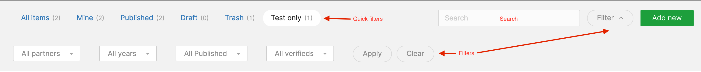

# Table builder

## Columns

In Twill you can customize the module tables and browser tables to your own need.

To modify the table you start by overwriting the `getIndexTableColumns(): TableColumns` method or
the `getBrowserTableColumns(): TableColumns` method for browser lists.

You can manage this in 2 ways, but the easiest is to self define the columns without
calling `parent::getIndexTableColumns`.

### Defining columns

To define columns start by instantiating a `TableColumns` object:

```php
use A17\Twill\Services\Listings\TableColumns;

protected function getIndexTableColumns(): TableColumns
{
    $columns = new TableColumns();
}
```

Then add as many fields as you need.

```php
use A17\Twill\Services\Listings\Columns\Text;
use A17\Twill\Services\Listings\TableColumns;

protected function getIndexTableColumns(): TableColumns
{
    $columns = new TableColumns();
    
    $columns->add(
        Text::make()
            ->field('title')
            ->title(twillTrans('Title'))
    );
    
    ...
}
```

### Extending base tables

In some cases you might want to just add some columns to your table. For this you can override the
following methods:

```php
/**
 * Similar to @see getBrowserTableColumns but these will be added on top of the default columns.
 */
protected function additionalBrowserTableColumns(): TableColumns
{
    return new TableColumns();
}

/**
 * Similar to @see getIndexTableColumns but these will be added on top of the default columns.
 */
protected function additionalIndexTableColumns(): TableColumns
{
    return new TableColumns();
}
```

For `additionalIndexTableColumns` these items will be added after the title.

In `additionalBrowserTableColumns` these will be added at the end.

#### Example for adding a thumbnail before the title

Using collection methods, you can easily add a thumbnail before the title column in the table:

```php
protected function getIndexTableColumns(): TableColumns
{
    $table = parent::getIndexTableColumns();

    $after = $table->splice(1);

    $table->push(
        Image::make()->field('cover')
    );

    return $table->merge($after);
}
```

### Column methods

There are currently 10 different columns. Most column share a set of setters that you can use. Because these columns
are regular php objects, you can always use your editor's autocomplete function to discover.

All columns are placed under the `src/Services/Listings/Columns` directory.

##### Frequently used

- `field(string $field)`: Sets the field in the model where the data should be fetched. This is usually mandatory but in
  some special columns it is not.
- `title(?string $title)`: The title to use, if none is provided a `Str::title` version of `field` will be used.
- `sortable(bool $sortable = true)`: Makes a column sortable.
- `optional(bool $optional = true)`: Makes a column optional.
- `hide(bool $hide = true)`: Hide the field by default. Only usable with optional.
- `linkToEdit(bool $linkToEdit = true)`: Link the field to the edit form.

##### Other methods

- `sortKey(?string $sortkey = null)`: The key to use when sorting.
- `renderHtml(bool $html = true)`: If the cms should render the contents as html. (Be careful when using this with
  unprotected data sources.)
- `customRender(Closure $renderFunction)`: A closure with a custom render function instead of using the raw field value.
- `linkCell(Closure|string $link)`: A closure or string on where to link the field contents to.
- `shrink(bool $shrink = true)`: Make the column shrink.

#### CustomRender

CustomRender can be useful if you want more control over how you want to render a certain column.

The example blow illustrates a possible usage:

```php
Text::make()
  ->field('customField')
  ->customRender(function (Model $model) {
    return view('my.view', ['title' => $model->title])->render();
  });
```

### Column types

Below is a list of columns and their function:

##### Text

`Text::make()->...`

Renders the (translated)value from the model

##### Boolean

`Boolean::make()->...`

Renders a ✅ or ❌ if the `field` is true or false.

##### Image

`Image:::make()->`

By default this renders the first role media in the model. You can specify the `role` and `crop` using their same named
methods.

If you add `rounded()` the image will be round.

Check the `Image` column class for more options.

##### PublishStatus

`PublishStatus:::make()->`

This field requires no additional methods, it shows on what dates the content will be published and when it will be
unpublished.

##### ScheduledStatus

`ScheduledStatus:::make()->`

This field requires no additional methods, it shows on what dates the content will be published and when it will be
unpublished.

##### NestedData

`NestedData::make()->...`

Renders the `field` using the relationship of the same name. It shows information and a link about the nested model.

##### Languages

`Languages::make()`

This field requires no additional methods, it will render the languages the content is available in.

##### Relation

`Relation::make()->...`

Renders the `field` of a  `relation` column.

For this column type both the relation and field should be provided. If one is missing an exception will be thrown.

##### Browser

`Browser::make()->...`

Renders the `field` of a  `browser` column.

For this column type both the browser and field should be provided. If one is missing an exception will be thrown.

##### Presenter

`Presenter::make()`

Renders a field using its presenter.

:::alert=type.warning:::
Presenters are currently undocumented and are here for backward compatability. If you want to customize the output of
a column you can use the `customRender` method.
:::#alert:::

### Custom columns

If you need you can easily define custom columns in your project by creating a class extending the `TableColumn`.

## Search

A search field will by default be shown on the top right of the listing. It will by default search the `title` of your
module, but you can extend or change that.

You can add `setSearchColumns` to your `setUpController` method like this:

```php
namespace App\Http\Controllers\Twill;

use A17\Twill\Http\Controllers\Admin\ModuleController;

class ProjectController extends BaseModuleController
{
    ...
    
    public function setUpController(): void
    {
        $this->setSearchColumns(['title', 'year']);
    }
}
```

## Filters

There are 2 types of filters that can be applied to a table.

- Quick filters, these provide instant access to a scoped list, such as published, drafts etc.
- Filters, these can be used for more in depth filtering of the results.

Quick filters and filters work together. They are not "or".



### Quick filters

By default every module comes with the following quick filters:

- All items
- Mine
- Published
- Draft
- Trash

To extend or modify this list we have to extend or overwrite the `quickFilters` method in the module controller.

```php
use A17\Twill\Services\Listings\Filters\QuickFilters;

public function quickFilters(): QuickFilters;
```

#### Adding quick filters

`QuickFilters` is a basic Laravel collection, this means you can do all known manipulations on that list.

You can get the default set of filters by calling:

```php
public function quickFilters(): QuickFilters
{
    return $this->getDefaultQuickFilters(); 
}
```

Then to, for example, add a new filter on top of that you can do the following:

```php
public function quickFilters(): QuickFilters
{
    $filters = $this->getDefaultQuickFilters();
    $filters->add(
        QuickFilter::make()
            ->queryString('test')
            ->label('Test only')
            ->amount(fn() => $this->repository->whereTranslation('title', 'test')->count())
            ->apply(fn(Builder $builder) => $builder->whereTranslation('title', 'test'))
    );

    return $filters;
}
```

A quick filter, as shown above has a few methods that can/need to be called:

- `queryString`: The unique query string that will be used in the url.
- `label`: The label to show in the filter, will be a "titled" version of queryString if not provided.
- `apply`: A closure with the Builder as parameter, this will by applied to the query of the list when the filter is
  active.
- `amount`: A closure that should return the amount of matches. Can be left out to show no number.
- `onlyEnableWhen`: A boolean indicating when the filter should be shown. By default the filter will always be visible.
- `disable`: Disables the filter.

#### Overriding quickfilters

If you want to use non of the existing filters but only apply your own you can create a new
instance `return Quickfilters::make(...);`.

### Filters

To further enhance user experience you can add more filters that can be used to refine the results.

Currently filters are only available as select lists. In the future we might extend on these.

#### Adding filters

By default no filters will be applied to you module listing.

In order to get started you will have to add the `filters` method to your module controller:

```php
use A17\Twill\Services\Listings\Filters\TableFilters;

public function filters(): TableFilters;
```

The same as with quick filters, the `TableFilters` object is an extension of a Laravel collection.

Example:

```php
public function filters(): TableFilters
{
    return TableFilters::make([
        BelongsToFilter::make()->field('partner'),
        FieldSelectFilter::make()->field('year'),
        BooleanFilter::make()->field('published')->label('Published'),
        BasicFilter::make()
            ->queryString('verified')
            ->options(collect(['yes' => 'Verified', 'no' => 'Not verified']))
            ->apply(function (Builder $builder, string $value) {
                if ($value === 'yes') {
                    $builder->where('is_verified', true);
                } elseif ($value === 'no') {
                    $builder->where('is_verified', false);
                }
            }),
    ]);
}
```

Filter methods:

- `label`: The label to show in the filter, will be a "titled" version of queryString if not provided.
- `queryString`: The unique query string that will be used in the url.
- `options`: A collection of key/value's that will be shown as selectable options.
- `apply`: The callback to apply the filter.
- `default`: Sets the default value of the filter.
- `withoutIncludeAll`: To remove the `all` option.
- `onlyEnableWhen`: A boolean indicating when the filter should be shown. By default the filter will always be visible.
- `disable`: Disables the filter.

#### Available filters

There are a few filters that you can use:

##### BasicFilter

Below is an example of a basic filter, you can use this to have full control over the values and queries.

```php
BasicFilter::make()
    ->queryString('verified')
    ->options(collect(['yes' => 'Verified', 'no' => 'Not verified']))
    ->apply(function (Builder $builder, string $value) {
        if ($value === 'yes') {
            $builder->where('is_verified', true);
        } elseif ($value === 'no') {
            $builder->where('is_verified', false);
        }
    });
```

##### BooleanFilter

The `BooleanFilter` can be used for simple true/false filters.

```php
BooleanFilter::make()->field('published')->label('Published');
```

##### FieldSelectFilter

This field will collect the available options from the list in the database.

It can be useful for example to make a select of "years" that a model can belong to.

```php
FieldSelectFilter::make()->field('year');
```

A fieldSelectFilter can also add a `Without value` option. This is disabled by default but you can enable it by calling
`->withWithoutValueOption()` on the filter.

##### BelongsToFilter

The `BelongsToFilter` will make a select with all titles of a relation.

```php
BelongsToFilter::make()->field('partner');
```

Additional parameters can be added, but Twill will try to figure these out for you if not provided:

- `model`: The model that should be used, for example `Partner::class`.
- `valueLabelField`: The field name that should be used for displaying the item label. Example: `title`
