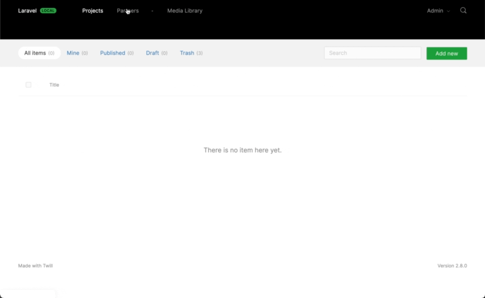

# BelongsToMany with pivot data

[BelongsToMany](https://laravel.com/docs/10.x/eloquent-relationships#many-to-many) is a great way to make one model refer to many others.

Examples could be:

- An order containing multiple products
- An artwork having multiple artists
- A project having multiple contributors

In addition to that we could use [pivot](https://laravel.com/docs/10.x/eloquent-relationships#retrieving-intermediate-table-columns) data to further extend this relation, to complete the examples above:

- Each product in the order can have an order specific price
- Each artwork artist may have focused on something specific
- Each contributor might have worked on a different part of a project

In Twill, we can set this up using a [repeater](../4_form-fields/11_repeater.md) and below we will go thorough all the steps to make this work, using the **project/contributor** example.

:::alert=type.info:::
The pivot can be left out in this example as well if you just want to have a BelongsToMany relation.
:::#alert:::

If you want to quickly test this in a new project, you can install twill using the portfolio example:
`php artisan twill:install portfolio`

## Database setup

We will set up 2 models, one is a Project model, you can do this using `php artisan twill:module Project`

And afterwards a Partner model: `php artisan twill:module Partner`.

In the **Partner** migration we add a relational table that we will use for our `BelongsToMany` relation.

:::filename:::
`database/migrations/2022_04_01_071748_create_partners_tables.php`
:::#filename:::

```phptorch
{
  "file": "../../../../examples/portfolio/database/migrations/2022_04_01_071748_create_partners_tables.php",
  "collapseAll": "",
  "focusMethods": "up",
  "focusImports": ["App\\Models\\Partner", "App\\Models\\Project"],
  "diffImports": ["App\\Models\\Partner", "App\\Models\\Project"],
  "diffInMethod": {
    "method": "up",
    "start": 20,
    "end": 26
  }
}
```

As you can see we added `$table->json('role')->nullable();` and `$table->integer('position')->default(999);`. While only the position one is mandatory, we will use the role pivot to store how the partner collaborated on the project.

In this case we chose `json` as our column type as we will make it multilingual, in other cases you can use any other type as per your requirements.

## Define the relation

Now with the migration setup we can set up our relation in the `Project` model:

:::filename:::
`app/Models/Project.php`
:::#filename:::

```phptorch
{
  "file": "../../../../examples/portfolio/app/Models/Project.php",
  "collapseAll": "",
  "focusMethods": "partners"
}
```

## Set up the repeater and form

To expose the relation in the ui, we will use an inline repeater. We will name this repeater a bit more specific as we want to make clear it is for the pivot table. But you can name it however you like.

:::filename:::
`app/Http/Controllers/Twill/ProjectController.php`
:::#filename:::

```phptorch
{
  "file": "../../../../examples/portfolio/app/Http/Controllers/Twill/ProjectController.php",
  "collapseAll": "",
  "focusImports": ["A17\\Twill\\Services\\Forms\\InlineRepeater"],
  "diffImports": ["A17\\Twill\\Services\\Forms\\InlineRepeater"],
  "focusMethods": "getForm",
  "diffInMethod": {
    "method": "getForm",
    "start": 6,
    "end": 22
  }
}
```

## Update the repository

As a final step we have to update the repository to map the repeater field to the relation.

:::filename:::
`app/Repositories/ProjectRepository.php`
:::#filename:::

```phptorch
{
  "file": "../../../../examples/portfolio/app/Repositories/ProjectRepository.php",
  "collapseAll": "",
  "focusMethods": ["afterSave", "getFormFields"],
  "diffInMethod": [
      {
        "method": "afterSave",
        "start": 17,
        "end": 24
      },
      {
        "method": "getFormFields",
        "start": 20,
        "end": 27
      }
  ]
}
```

Take note of the methods as they are different from other repeater methods: `updateRepeaterWithPivot`,
`getFormFieldForRepeaterWithPivot`

In the 4th parameter you can pass all the fields that should be written into the pivot table, the position is automatically taken care of.

## Result

And you are done. When you now create or edit a Project model you can select existing partners and set their role in the project.


