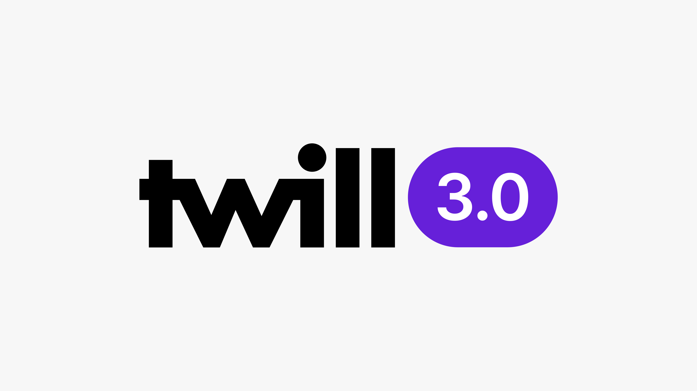

# Documentation

## About Twill

Twill is an open source Laravel package that helps developers rapidly create a custom CMS that is beautiful, powerful, and flexible. By standardizing common functions without compromising developer control, Twill makes it easy to deliver a feature-rich admin console that focuses on modern publishing needs.

Twill is an [AREA 17](https://area17.com) product. It was crafted with the belief that content management should be a creative, productive, and enjoyable experience for both publishers and developers.

## Benefits

With Twill's vast number of pre-built features and associated library of Vue.js UI components, developers can focus their efforts on the unique aspects of their applications instead of rebuilding standard ones.

Built to get out of your way, Twill offers:

- No lock-in, create your own data models or hook existing ones
- No front-end assumptions, use it within your Laravel app or as a headless CMS
- No bloat, turn off features you don’t need
- No need to write/adapt HTML for the admin UI
- No limits, extend as you see fit

## Feature List

### Modules

* Enhanced Laravel “resources” models
* Command line generator and conventions to speed up creating new ones
* Based on PHP traits and regular Laravel concepts (migrations, models, controllers, form requests, repositories, Blade views)
* Fully custom forms per content type
* Slug management, including the ability to automatically redirect old urls
* Configurable content listings with searching, filtering, sorting, publishing, featuring, reordering and more
* Support for all Eloquent ORM relationships (1-1, 1-n, n-n, polymorphic)
* Content versioning

### CMS UI Components

* Large library of plugged-in Vue.js form components with tons of options for maximum flexibility and composition
* Completely abstracted HTML markup. You’ll never have to deal with Bootstrap HTML again, which means you won’t ever have to maintain frontend-related code for your CMS
* Input, text area, rich text area form fields with option to set SEO optimized limits
* Configurable WYSIWYG built with TipTap
* Inline translated fields with independent publication status (no duplication)
* Select, multi-select, content type browsers for related content and tags
* Form repeaters
* Date and color pickers
* Flexible content block editor (dynamically composable from all form components)
* Custom content blocks per content type

### Media library

* Media/files library with S3 and imgix integration (3rd party services are swappable)
* Image selector with smart cropping
* Ability to set custom image requirements and cropping parameters per content type
* Multiple crops possible per image for art directed responsive
* Batch uploading and tagging
* Metadata editing (alternative text, caption)
* Multi fields search (filename, alternative text, tags, dimensions…)

### Configuration based features

* User authentication, authorization and management
* Fully configurable CMS navigation, with three levels of hierarchy and breadcrumbs for limitless content structure
* Configurable CMS dashboard with quick access links, activity log and Google Analytics integration
* Configurable CMS global search
* Intuitive content featuring, using a bucket UI. Put any of your content types in "buckets" to manage any layout of featured content or other concepts like localization

### Developer experience

* Maintain a Laravel application, not a Twill application
* Support for Laravel 9 and up – Twill will be updated to support all future versions
* Support for both MySQL and PostgreSQL databases
* No conflict with other Laravel packages – keep building with your tools of choice
* No specific server requirements, if you can deploy a Laravel application, you can deploy Twill
* No data lock in – all Twill content types are proper relational database tables, so it’s easy to move to Twill from other solutions and to expose content created with your Twill CMS to other applications
* Previewing and side by side comparison of fully rendered frontend site that you’ll get up and running very quickly no matter how you built your frontend (fully headed Laravel app, hybrid Laravel app with your own custom API endpoints or even full SPA with frameworks like React or Vue)
* Scales to very large amount of content without performance drawbacks, even on minimal resources servers (for what it’s worth, it’s running perfectly fine on a $5/month VPS, and you can cache frontend pages if you’d like through packages like laravel-response-cache or a CDN like Cloudfront)

## Architecture Concepts

### Modules

A Twill [module](./3_modules/) is a set of classes and configurations in your Laravel application that enable your publishers to manage a certain type of content. The structure of a CRUD module is completely up to you.

Another way to think of a CRUD module is as a feature rich Laravel resource. In other words (and for the non-Laravel developer), a CRUD module is basically a content type (or post type, as sometimes called by other CMS solutions) with CRUD operations (Create, Read, Update, Delete), as well as custom Twill-provided operations like: Publish, Feature, Tag, Preview, Restore, Restore revision, Reorder or Bulk edit. Using Twill's media library, images and files can be attached to modules records. Also, using Twill's block editor, a rich editing experience of a module's record can be offered to publishers.

In Twill's UI, a CRUD module most often consists of a listing page and a form page or modal. Records created under a module can then be associated with other modules' records to create relationships between your content. Records of your Twill modules and any associations are stored in a traditional relational database schema, following Laravel's migrations and Eloquent model conventions.

Twill's CRUD modules features are enabled using PHP traits you include in your Eloquent models and Twill repositories, as well as various configuration variables, and a bunch of conventions to follow. Further guidance is documented in the [modules](./3_modules/) section.

A Twill module can be modified however you like – you can include countless types of content fields, and change the organization and structure according to the needs of the module and your product. Setup is simple: you just need to compose a form using all of Twill's available form fields.

### Recommended content types

While possibilities for composition are endless, we’ve identified four standard content types:

#### Entities

Entities are your primary data models, usually represented on your frontend as listing and detail views. Generally speaking, entity listings are displayed programmatically (e.g., by date, price, etc.) but also can be manually ordered. For example, if you’re building an editorial site, your primary entity might be articles. If you’re building a site to showcase your company’s work, you might have entities for projects, case studies, people, etc. This is the default behavior of a Twill module.

#### Attributes

Attributes are secondary data models most often used to add structured details to an entity (for search, filtering, and/or display). Example attributes include: categories, types, sectors, industries, etc. In a Twill CMS, each attribute needs a listing screen and, within that screen, quick creation and editing ability. As attributes tend to be relatively simple (few content fields, etc), their form screen can often fit within a modal. This modal can be made available from other parts of the CMS rather than only from their own listing screen. In Twill, the `editInModal` index option of your module's controllers can be used to enable that behavior.

#### Pages

Pages are unstructured data models most often used for static content, such as an About page. Rather than being
separated into listing and detail screens, pages are manually organized into parent/child relationships. Combined with the [kalnoy/nestedset](https://github.com/lazychaser/laravel-nestedset) package, a Twill module can be configured to show and make parent/child relationships manageable on a module's records.

#### Elements

Elements are modules or snippets of content that are added to an entity, page, or screen. Examples include the ability to manage footer text or create a global alert that can be turned on/off, etc. Twill offers developers the ability to quickly create [settings sections](./8_settings-sections) to manage elements. A Twill module could also be configured to manage any sort of standalone element or content composition. There's nothing wrong with having a database table with a single record if that is what your product require, so you should feel free to create a Twill module to have a custom form for a single record. You can use a Laravel seeder or migration to initialize your admin console with those records.

### CRUD listings

One of the benefits of Twill is the ability to fully customize CRUD listing views. At minimum, you’ll want to include the key information for each data record so that publishers can have an at-a-glance view without having to click into a record. You can also set up a default view and give each publisher the ability to customize the columns and the number of records per pagination page.

In certain cases, you may require nested CRUD modules. For example, if you are building a handbook website, the parent CRUD would be the handbooks and then within each handbook there are pages (child CRUD). In this case, the listing will be the parent CRUD and for each record, you’d include a column to access the child CRUDs for each.

### CMS navigation

One of the benefits of Twill is the ability to fully customize the navigation as needed to make it easy and intuitive for publishers to navigate through the CMS and perform their regular production duties. Twill has three levels of navigation:

#### Main navigation

We recommend that the main navigation reflects the frontend organization, in that way, it is intuitive for publishers. Additionally, the main navigation includes transversal items such as media library and global settings.

#### Secondary navigation

We recommend that you group all entities, attributes, pages, and possibly buckets (see below) under each main navigation item. For example, if you have a section called “Our work” then the secondary navigation will include: case studies (entity), sectors (attribute), how we work (page), featured (buckets), etc.

#### Tertiary navigation

In certain cases, you will need a third level of navigation, however we recommend that you only use it when absolutely necessary, otherwise content may be too buried. You also have the option to turn the tertiary navigation into a breadcrumb.

### Block editor

Central to the Twill experience is the block editor, giving publishers full control of how they construct the content of a record. A block is a composition of form fields made available to publishers in Twill's block editor form field.

Generally speaking, with a standard CMS, all content is managed through fixed forms. While in a Twill CMS some of the content may be fixed (such as title, subtitle, intro, required content, etc.), when using the block editor, the content is constructed by adding and reordering blocks of content. This gives you maximum flexibility to build narrative experiences on the front end.

For example, let’s say you’re building a blog. Your blog post form may require fixed content such as the title, short description, author, etc. But then you can use the block editor for the body of the post, allowing the publisher to add standardized blocks for text, images, quotes, slideshows, videos, related content, embeds, etc. and reorder them as needed.

A block can include any combination of fields, including repeater fields and even data pulled from a third party
service. Each block also can contain additional options so that a single block can be displayed according to different variations. This obviates the need to create a new block every time you need a different display of your content, and allows you to match the build of the page to the content, context or design required. For example, you can have a media block that may alternatively include a video or an image, be displayed at small, medium or large, or displayed inline with content or full screen.

To keep page-building as simple as possible, we recommend that you keep blocks to a minimum – ideally no more than 8 blocks, if possible. When adding a new block, consider: is this a unique block or simply block options? Publishers will prefer switching an option using existing content rather than having to create another block and copy and paste.

It is also important that you work with a designer early on to discuss the block strategy and make sure your content works well no matter how your publishers arrange it. Can all the blocks work in any combination or are there restrictions? If the latter, you can create form validations to block publishers from arranging blocks in certain contexts.

### Buckets

Buckets are used to feature content. While the name might be boring, your publishers will love them!

The functionality is made up of two parts: an entity navigator and buckets. The entity navigator gives access to the entities, including search and filters. Buckets represent your feature areas. For example, let’s say you have a homepage with main features (such as a hero display pointing your users to 2-3 pages), secondary features (such as a grid of content), and tertiary features. You would create three buckets for each of these feature sections. Then, your publishers can simply drag the desired entity to the bucket they want it featured in.

You can also associate rules for your buckets. For example, let’s say you only want three main features and five
secondary features – but unlimited tertiary features. You can add those restrictions and when the publishers try to add more than the limit, they will be informed they need to remove an entity before they can add another.

While buckets are primarily used for featuring, they can also be used for any purpose. For example, if you have a website that has different navigation for different market locations (e.g. USA, Europe, Asia), you can use buckets to manage this.

## Contribution Guide

### Code of Conduct

Twill is dedicated to building a welcoming, diverse, safe community. We expect everyone participating in the Twill community to abide by our [Code of Conduct](https://github.com/area17/twill/blob/main/CODE_OF_CONDUCT.md). Please read it. Please follow it.

### Bug reports and features submission

To submit an issue or request a feature, please do so on [GitHub](https://github.com/area17/twill/issues).

If you file a bug report, your issue should contain a title and a clear description of the issue. You should also include as much relevant information as possible and a code sample that demonstrates the issue. The goal of a bug report is to make it easy for yourself - and others - to replicate the bug and develop a fix.

Remember, bug reports are created in the hope that others with the same problem will be able to collaborate with you on solving it. Do not expect that the bug report will automatically see any activity or that others will jump to fix it. Creating a bug report serves to help yourself and others start on the path of fixing the problem.

### Security vulnerabilities

If you discover a security vulnerability within Twill, please email us at [security@twill.io](mailto:security@twill.io). All security vulnerabilities will be promptly addressed.

### Versioning scheme

Twill follows [Semantic Versioning](https://semver.org/). Major releases are released only when breaking changes are necessary, while minor and patch releases may be released as often as every week. Minor and patch releases should never contain breaking changes.

When referencing Twill from your application, you should always use a version constraint such as `^3.0`, since major releases of Twill do include breaking changes.

### Which branch?

All bug fixes should be sent to the latest stable branch (`3.x`). Bug fixes should never be sent to the `main` branch unless they fix features that exist only in the upcoming release.

Minor features that are fully backwards compatible with the current Twill release may be sent to the latest stable branch (`3.x`).

Major new features should always be sent to the `main` branch, which contains the upcoming Twill release.

Please send coherent history — make sure each individual commit in your pull request is meaningful. If you had to make a lot of intermediate commits while developing, please [squash them](http://www.git-scm.com/book/en/v2/Git-Tools-Rewriting-History#Changing-Multiple-Commit-Messages) before submitting.

### Coding style

- PHP: [PSR-12 Coding Standard with small changes](https://github.com/area17/twill/blob/3.x/phpcs.xml).

- Javascript: [Standard](https://standardjs.com/), [Vue ESLint Essentials](https://github.com/vuejs/eslint-plugin-vue).

## Licensing

### Software

The Twill software is licensed under the [Apache 2.0 license](https://www.apache.org/licenses/LICENSE-2.0.html).

### User interface

The Twill UI, including but not limited to images, icons, patterns, and derivatives thereof are licensed under
the [Creative Commons Attribution 4.0 International License](https://creativecommons.org/licenses/by/4.0/).

### Attribution

By using the Twill UI, you agree that any application which incorporates it shall prominently display the message “Made with Twill” in a legible manner in the footer of the admin console. This message must open a link to twillcms.com when clicked or touched. For permission to remove the attribution, contact us at [hello@twill.io](mailto:hello@twill.io).

## 2.x documentation
Documentation for Twill versions below 3.0 is available for reference [here](https://twillcms.com/docs/2.x).

## 1.x documentation
Documentation for Twill versions below 2.0 is available for reference [here](https://twillcms.com/docs/1.x).

