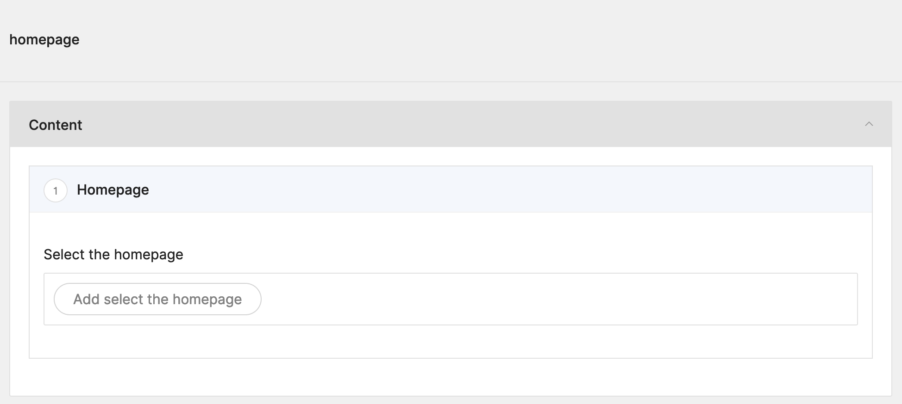

# Setup the frontpage

As mentioned before, Twill is headless, it makes no assumptions about what you are trying to build and does not come
with a front-end.

We made one, we made a menu, but when you visit `/`, the root of your domain, you will still see the standard Laravel
landing page.

Let's fix that with a [setting](../../1_docs/8_settings-sections/index.md)!

## Adding a settings section

In Twill, we can make settings sections, this we will now use to create a setting in which you can select a front-page
page.

We will go back to the `AppServiceProvider` that we used before and register the setting section:

```phptorch
{
  "collapseAll": "",
  "focusMethods": "boot",
  "diffInMethod": {
    "method": "boot",
    "start": 7,
    "end": 9
  }
}
##CODE##
<?php

namespace App\Providers;

use A17\Twill\Facades\TwillAppSettings;
use A17\Twill\Services\Settings\SettingsGroup;
use Illuminate\Support\ServiceProvider;
use A17\Twill\Facades\TwillNavigation;
use A17\Twill\View\Components\Navigation\NavigationLink;

class AppServiceProvider extends ServiceProvider
{
    public function register()
    {
    }

    public function boot()
    {
        TwillNavigation::addLink(
            NavigationLink::make()->forModule('pages')
        );
        TwillNavigation::addLink(
            NavigationLink::make()->forModule('menuLinks')->title('Menu')
        );
        TwillAppSettings::registerSettingsGroup(
            SettingsGroup::make()->name('homepage')->label('Homepage')
        );
    }
}
```

This will register the settings group for us. If we go to the back-end and refresh, we will see a "settings" link in the
menu.

However, when clicking it, we will get an exception. This is to be expected as we registered a settings group, we still
need to create the folder and setting itself.

Create the following directory: `resources/views/twill/settings/homepage`

This directory will hold our settings blade files. A settings file is just a regular block file. So the same way we can
write our blocks, we can write our settings!

Let's create `resources/views/twill/settings/homepage/homepage.blade.php` and add the following:

```blade
@twillBlockTitle('Homepage')
@twillBlockIcon('text')
@twillBlockGroup('app')

<x-twill::browser
    label="Select the homepage"
    module-name="pages"
    name="page"/>
```

Now, head back to the cms and you should see the following:



Press browse, select a page and let's continue by writing the required front-end code to use it!

## Writing the controller

If we open up `routes/web.php` again, we see a small part about the welcome view, we will replace that with a call to
our page controller:

```php
Route::get('/', function () { // [tl! --]
    return view('welcome'); // [tl! --]
}); // [tl! --]
Route::get('/', [\App\Http\Controllers\PageDisplayController::class, 'home'])->name('frontend.home'); // [tl! ++]
Route::get('{slug}', [\App\Http\Controllers\PageDisplayController::class, 'show'])->name('frontend.page');
```

Then we add the `home` method in the `PageDisplayController` which will get the setting and return the proper page:

```phptorch
{
  "collapseAll": "",
  "focusMethods": "home",
  "diffMethods": "home"
}
##CODE##
<?php

namespace App\Http\Controllers;

use A17\Twill\Facades\TwillAppSettings;
use App\Repositories\PageRepository;
use Illuminate\Contracts\View\View;

class PageDisplayController extends Controller
{
    public function show(string $slug, PageRepository $pageRepository): View
    {
        $page = $pageRepository->forSlug($slug);

        if (!$page) {
            abort(404);
        }

        return view('site.page', ['item' => $page]);
    }

    public function home(): View
    {
        if (TwillAppSettings::get('homepage.homepage.page')->isNotEmpty()) {
            /** @var \App\Models\Page $frontPage */
            $frontPage = TwillAppSettings::get('homepage.homepage.page')->first();

            if ($frontPage->published) {
                return view('site.page', ['item' => $frontPage]);
            }
        }

        abort(404);
    }
}
```

There's a bit more code here, we do some additional checking to make sure an item is selected and it is published.
That way we never show any content that should not be visible yet.

And that's it! You have completed the guide!

We made a lot of progress, we have a block builder, a menu, settings and a front-end!

You now know about all the basics it requires to build sites with Twill.

If you have more questions, feel free to get in touch on Discord or Github!
