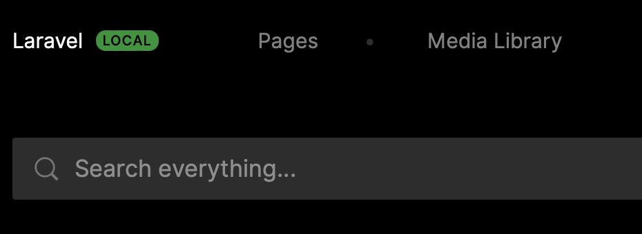

# Creating the page module

Now that we are ready with the initial setup of Laravel and Twill we can start building our CMS.

In Twill we use Modules. A module is a single "content type" and exists out of a few files:

- A model class (in `app/Models`)
  - This is your regular Laravel eloquent model. It tells Laravel how your content type is defined and is used to make
    the link to the database.
- A module controller class (in `app/Http/Controllers/Twill`)
  - The module controls controls how your module interacts with the cms, you can see it as a bridge between your model
    and the CMS front-end ui.
- A repository class (in `app/Repositories`)
  - The repository is used to handle saving, reading and more of your model. This is also the place where we would
    add custom pre/post save actions and much more!
- A requests class (in `app/Http/Requests/Twill`)
  - The request class is in between form requests. It is mainly used to provide validation!
- (Optionally) a form blade file
  - In Twill 3 there are 2 ways to build the form that you will see in the CMS, we will go more in depth about these
    later in the guide.

So, we now know a bit about what files there are (specific to Twill) and what their purpose is. The next step would be
to create them.

Creating these files manually would be, painful. Their naming conventions would need to match, the base content would
need to be set, that is a lot of work!

Luckily, Twill comes with a few useful [artisan](https://laravel.com/docs/10.x/artisan) commands. (Artisan is the command
line toolkit of Laravel. You used this before to install Twill itself.)

While there are many commands that you can run, we will focus on just one at the moment.

### Exploring `php artisan twill:make:module`

The `php artisan twill:make:module` is the main way of creating a module to be added in your CMS.

If you want to see what options this command takes, you can add `--help` like this:

`php artisan twill:make:module --help`

This will show you all the available options:

```shell
$ php artisan twill:make:module --help

Description:
  Create a new Twill Module

Usage:
  twill:make:module [options] [--] <moduleName>

Arguments:
  moduleName

Options:
  -B, --hasBlocks
  -T, --hasTranslation
  -S, --hasSlug
  -M, --hasMedias
  -F, --hasFiles
  -P, --hasPosition
  -R, --hasRevisions
  -N, --hasNesting
      --bladeForm
  -E, --generatePreview
      --parentModel[=PARENTMODEL]
      --all
```

As you can see, we can pass a few options, but there is only one thing mandatory, and that is the name of our module.

If Twill needs to know more about your intentions, the command will ask you.

The module name **should** always be in a plural form, this is important for the code generator. After all, we are talking
to a computer, it does not always correctly guess if a word is singular or plural.

## Creating the pages module

Now that we know what a module is and how we can generate one. We can go ahead and actually do it!

`php artisan twill:make:module pages`

You will be prompted to answer some questions and while we could have used the options to configure these, it is good to
see what the options are with a bit more explanation.

For this module we will answer:

- Do you need to use the block editor on this module: **yes**
- Do you need to translate content on this module: **yes**
- Do you need to generate slugs on this module: **yes**
- Do you need to attach images on this module: **yes**
- Do you need to attach files on this module: **no**
- Do you need to manage the position of records on this module: **no**
- Do you need to enable revisions on this module: **yes**
- Do you need to enable nesting on this module: **no**
- Do you also want to generate the preview file: **yes**

Great! That was quite a bit, but our module should now be as we want it.

As a quick note, you may not need translatable content, but usually it is good to prepare for the future when it comes
to translations. When we build the front-end, as long as you do not enable more that one language it is basically a non
translated website.

Once the command is complete you will be prompted with some instructions:

```shell
The following snippet has been added to routes/twill.php:
┌──────────────────────────────────┐
│ use A17\Twill\Facades\TwillRoutes│
│ TwillRoutes::module('pages');    │
└──────────────────────────────────┘
To add a navigation entry add the following to your AppServiceProvider BOOT method.
**************************
use A17\Twill\Facades\TwillNavigation;
use A17\Twill\View\Components\Navigation\NavigationLink;

TwillNavigation::addLink(
    NavigationLink::make()->forModule('pages')
);
**************************
Do not forget to migrate your database after modifying the migrations.
```

Let's have a look at them:

### Module routes

We can see that `Route::module('pages');` has been added to `routes/twill.php`.

This is automatic, because it is simple enough to do.

The `routes/twill.php` file is a Twill specific list of routes. These routes are protected and loaded specifically for 
the CMS.

In standard Laravel there is no `module` method on a `Route` object, this is something Twill provides and it will build
many routes for your module, these are then used by the cms, controllers and requests to make everything work together.

### Navigation link

The second step, we have to do ourself. So let's open `app/Providers/AppServiceProvider.php`.

We will not go into detail about what a service provider is, for that you can check the 
[official documentation](https://laravel.com/docs/10.x/providers).

In our `boot` method we will add the suggested snippet:

```phptorch
{
    "collapseMethods": "register",
    "diffImports": [
	  "A17\\Twill\\Facades\\TwillNavigation",
	  "A17\\Twill\\View\\Components\\Navigation\\NavigationLink"
    ],
    "diffInMethod": {
      "method": "boot",
      "start": 2,
      "end": 4
    }
}
##CODE##
<?php

namespace App\Providers;

use Illuminate\Support\ServiceProvider;
use A17\Twill\Facades\TwillNavigation;
use A17\Twill\View\Components\Navigation\NavigationLink;

class AppServiceProvider extends ServiceProvider
{
    /**
     * Register any application services.
     *
     * @return void
     */
    public function register()
    {
        //
    }

    /**
     * Bootstrap any application services.
     *
     * @return void
     */
    public function boot()
    {
        TwillNavigation::addLink(
            NavigationLink::make()->forModule('pages')
        );
    }
}
```

`TwillNavigation` is a [Facade](https://laravel.com/docs/10.x/facades#main-content) that Twill provides to manage the
administration menu.

`NavigationLink` is a blade component, but with some additional methods. This is used to render the actual link.

In the future, you might define more links. For this, order is important as it is this order that is also used for
displaying.

### Migration

We ran database migrations before, but every time you add a new migration to `database/migrations` you need to run
`php artisan migrate`.

But before that, have a look at `database/migrations/..._create_pages_table.php`:

```php
<?php

use Illuminate\Database\Migrations\Migration;
use Illuminate\Database\Schema\Blueprint;
use Illuminate\Support\Facades\Schema;

class CreatePagesTables extends Migration
{
    public function up()
    {
        Schema::create('pages', function (Blueprint $table) {
            // this will create an id, a "published" column, and soft delete and timestamps columns
            createDefaultTableFields($table);
            
            // add those 2 columns to enable publication timeframe fields
            // (you can use publish_start_date only if you don't need to provide the ability to specify an end date)
            // $table->timestamp('publish_start_date')->nullable();
            // $table->timestamp('publish_end_date')->nullable();
        });

        Schema::create('page_translations', function (Blueprint $table) {
            createDefaultTranslationsTableFields($table, 'page');
            $table->string('title', 200)->nullable();
            $table->text('description')->nullable();
        });

        Schema::create('page_slugs', function (Blueprint $table) {
            createDefaultSlugsTableFields($table, 'page');
        });

        Schema::create('page_revisions', function (Blueprint $table) {
            createDefaultRevisionsTableFields($table, 'page');
        });
    }

    public function down()
    {
        Schema::dropIfExists('page_revisions');
        Schema::dropIfExists('page_translations');
        Schema::dropIfExists('page_slugs');
        Schema::dropIfExists('pages');
    }
}
```

This file will create the minimum required tables and columns that Twill uses to provide the CMS functionality. Later in
the guide we may add some more fields to the database, but will will do that in a new migration.

Once you are more experienced with Twill, you may want to add fields at this moment, before you run the migrate command.
That way, you do not have to immediately add a new migration file.

Alright, now lets run:

`php artisan migrate`

## Creating our first page

Great, we looked at all the files and did our migration. Let's create some content now!

Head back over to the browser and visit your CMS. If you followed the steps correctly, the navigation bar should now
show our Pages link!



Open it up, and you will be presented with an empty page list, almost there!

On the top right press the button "Add new", enter a title and press "Create". You now have your first page!

**Awesome, in the next steps we will improve a bit the default controller so that our page fit's our needs.**
