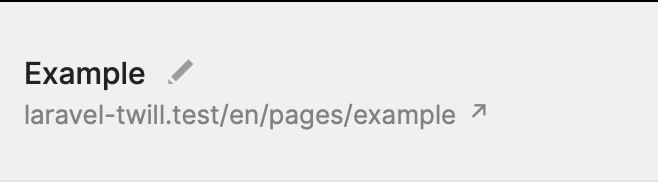
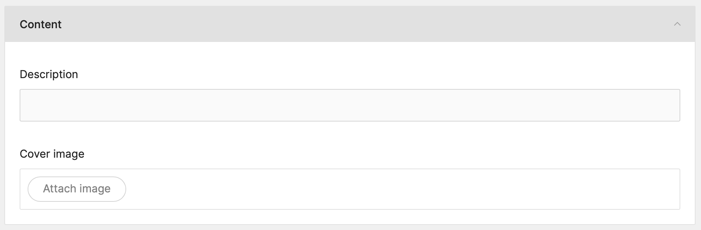
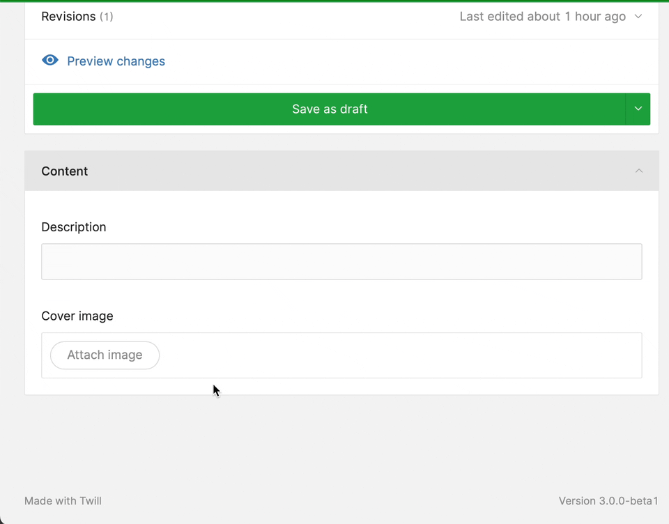
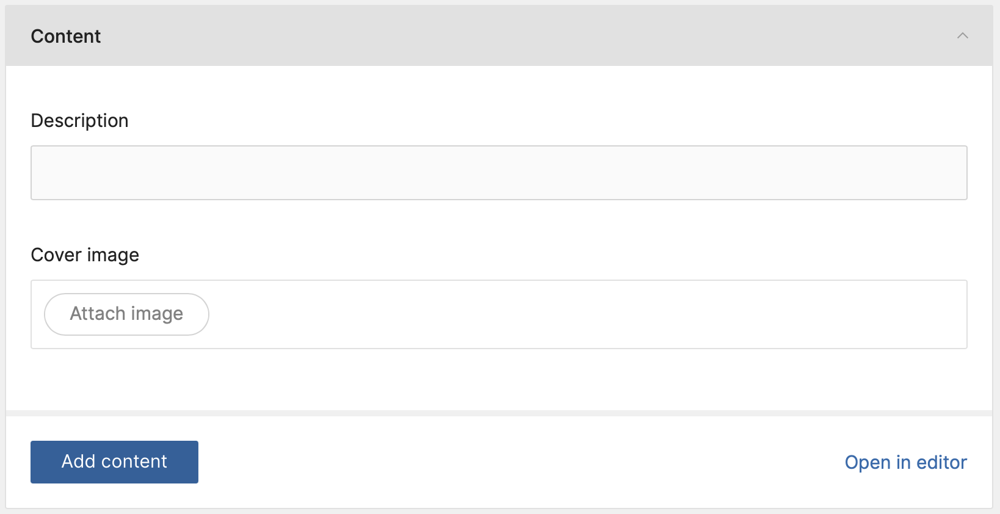

# Configuring the page module

In the last section of this guide we created the pages module. We created some content, but besides that, there is not
yet much to see.

We will make one small change to how our slug is generated. Besides that we will add 2 things to our page module:

- A cover image
- And a block editor

## Changing the slug

If you look at the page in edit mode, you will notice that under the title there is a generated slug:



While in some cases this would be correct, for this one, we will need to change it. All our pages will be directly under
the root of our website. We will also remove the language parameter as we will not implement it in this guide.

Open up the page controller `app/Http/Controllers/Twill/PageController.php` and setup the controller:

```phptorch
{
  "diffMethods": "setUpController"
}
##CODE##
<?php

namespace App\Http\Controllers\Twill;

use A17\Twill\Http\Controllers\Admin\ModuleController as BaseModuleController;

class PageController extends BaseModuleController
{
    protected $moduleName = 'pages';

    /**
     * This method can be used to enable/disable defaults. See setUpController in the docs for available options.
     */
    protected function setUpController(): void
    {
        $this->setPermalinkBase('');
        $this->withoutLanguageInPermalink();
    }
}
```

We set our `permalinkBase` to an empty string instead of letting it default to the name of our model which is `pages`.

Then we add `withoutLanguageInPermalink` to tell the controller to not use the language permalink.

Refresh the page and you now see that the slug is cleaned up.

:::alert=type.warning:::
These changes do not affect how the model's slug is stored in the database, it just changes the visual representation of
it.

Model slugs are always saved purely based on the content you enter. If you enter 'example' in the url field when 
creating or editing the model, that is what will be saved. 

The front-end is always responsible for handling the slugs.
:::#alert:::

## About Twill images

Before we dive in, let's talk about how Twill approaches this, this is important to know how to link things up later.

In Twill we use crop configurations. For example (the default provided for all modules):

```php
'cover' => [
    'default' => [
        [
            'name' => 'default',
            'ratio' => 16 / 9,
        ],
    ],
    'mobile' => [
        [
            'name' => 'mobile',
            'ratio' => 1,
        ],
    ],
    'flexible' => [
        [
            'name' => 'free',
            'ratio' => 0,
        ],
        [
            'name' => 'landscape',
            'ratio' => 16 / 9,
        ],
        [
            'name' => 'portrait',
            'ratio' => 3 / 5,
        ],
    ],
],
```

We can see that our main array key is named "cover", that is our image **role**. This is just what we use to identify
the
field and purpose of the image.

Inside of that we have 3 additional array keys, these are our **crop names**. These are usually used to provide
different
variants of the image for different purposes, for example, one for desktop, one for mobile etc.. Other examples could be
for a listing on the search results.

As you can see in the *flexible* key, there are 3 items. These can be used to let the content editor decide which of
the 3 formats to use.

### Adding crop roles

Depending on what we are working on, there are 2 places where we can set these up.

If you want to make a role available to **all** your modules, you can add the in the `config/twill.php` file:

```php
<?php

return [
    'default_crops' => [
        'page_cover' => [
            'default' => [
                [
                    'name' => 'default',
                    'ratio' => 16 / 9,
                ]
            ]
        ]
    ]
];
```

But that may not always be the desired approach. If your image roles are more bound to your model we can add them in our
models instead:

```phptorch
{
    "collapseAll": "",
    "focusProperties": "mediasParams"
}
##CODE##
<?php

namespace App\Models;

use A17\Twill\Models\Behaviors\HasBlocks;
use A17\Twill\Models\Behaviors\HasTranslation;
use A17\Twill\Models\Behaviors\HasSlug;
use A17\Twill\Models\Behaviors\HasMedias;
use A17\Twill\Models\Behaviors\HasRevisions;
use A17\Twill\Models\Model;

class Page extends Model
{
    use HasBlocks, HasTranslation, HasSlug, HasMedias, HasRevisions;

    protected $fillable = [
        'published',
        'title',
        'description',
    ];

    public $translatedAttributes = [
        'title',
        'description',
        'active',
    ];

    public $slugAttributes = [
        'title',
    ];

    public $mediasParams = [
        'cover' => [
            'default' => [
                [
                    'name' => 'default',
                    'ratio' => 16 / 9,
                ],
            ],
            'mobile' => [
                [
                    'name' => 'landscape',
                    'ratio' => 16 / 9,
                ],
            ],
        ],
    ];
}
```

Finally, there are roles specific to blocks, but we will get back to these later in the guide.

## Adding the image field to the pages module

Now that we know this, we can decide on how to add our media field to our pages module.

For this guide, we do not have to create new crops as we will use the default `cover` crop. But still it was important
to know about how they work for when you want to customize more!

Let's open up our module controller `app/Http/Controllers/Twill/PageController.php` and add the field to the getForm
method.

Important note here, the name we give our field will also be used to match with our crop configuration. So make sure you
always have a crop config for your field name!

```phptorch
{
    "collapseMethods": null,
    "focusMethods": "getForm",
    "diffImports": "A17\\Twill\\Services\\Forms\\Fields\\Medias",
    "focusImports": "A17\\Twill\\Services\\Forms\\Fields\\Medias",
    "diffInMethod": {
        "method": "getForm",
        "start": 7,
        "end": 9
    }
}
##CODE##
<?php

namespace App\Http\Controllers\Twill;

use A17\Twill\Models\Contracts\TwillModelContract;
use A17\Twill\Services\Forms\Fields\Medias;
use A17\Twill\Services\Listings\Columns\Text;
use A17\Twill\Services\Listings\TableColumns;
use A17\Twill\Services\Forms\Fields\Input;
use A17\Twill\Services\Forms\Form;
use A17\Twill\Http\Controllers\Admin\ModuleController as BaseModuleController;

class PageController extends BaseModuleController
{
    protected $moduleName = 'pages';

    public function getForm(TwillModelContract $model): Form
    {
        $form = parent::getForm($model);

        $form->add(
            Input::make()->name('description')->label('Description')->translatable()
        );

        $form->add(
            Medias::make()->name('cover')->label('Cover image')
        );

        return $form;
    }
}
```

Nice! We can now go back to a create or edit page for our page module and we should see the media field:

<!-- <div class="max-w-lg mx-auto"></div> -->


And when we actually attach a file we can see that the default crop configuration is being applied!

<!-- <div class="max-w-lg mx-auto"></div> -->


## Adding the block editor

The final step we have to do is to add a block editor field. This will enable the drag-and-drop editor for our page!

The approach is the same.

We edit the module controller `app/Http/Controllers/Twill/PageController.php` and add the field to the getForm
method.

```phptorch
{
    "collapseMethods": null,
    "focusMethods": "getForm",
    "diffImports": "A17\\Twill\\Services\\Forms\\Fields\\BlockEditor",
    "focusImports": "A17\\Twill\\Services\\Forms\\Fields\\BlockEditor",
    "diffInMethod": {
        "method": "getForm",
        "start": 11,
        "end": 13
    }
}
##CODE##
<?php

namespace App\Http\Controllers\Twill;

use A17\Twill\Models\Contracts\TwillModelContract;
use A17\Twill\Services\Forms\Fields\BlockEditor;
use A17\Twill\Services\Forms\Fields\Medias;
use A17\Twill\Services\Listings\Columns\Text;
use A17\Twill\Services\Listings\TableColumns;
use A17\Twill\Services\Forms\Fields\Input;
use A17\Twill\Services\Forms\Form;
use A17\Twill\Http\Controllers\Admin\ModuleController as BaseModuleController;

class PageController extends BaseModuleController
{
    protected $moduleName = 'pages';

    public function getForm(TwillModelContract $model): Form
    {
        $form = parent::getForm($model);

        $form->add(
            Input::make()->name('description')->label('Description')->translatable()
        );

        $form->add(
            Medias::make()->name('cover')->label('Cover image')
        );

        $form->add(
            BlockEditor::make()
        );

        return $form;
    }
}
```

Head over to the form once more and you will see that there is now a block editor at the bottom!

<!-- <div class="max-w-lg mx-auto"></div> -->


And that is about it for now! We have our page module, a media field for the cover image and a block editor.

In the next section we will create our own block!
