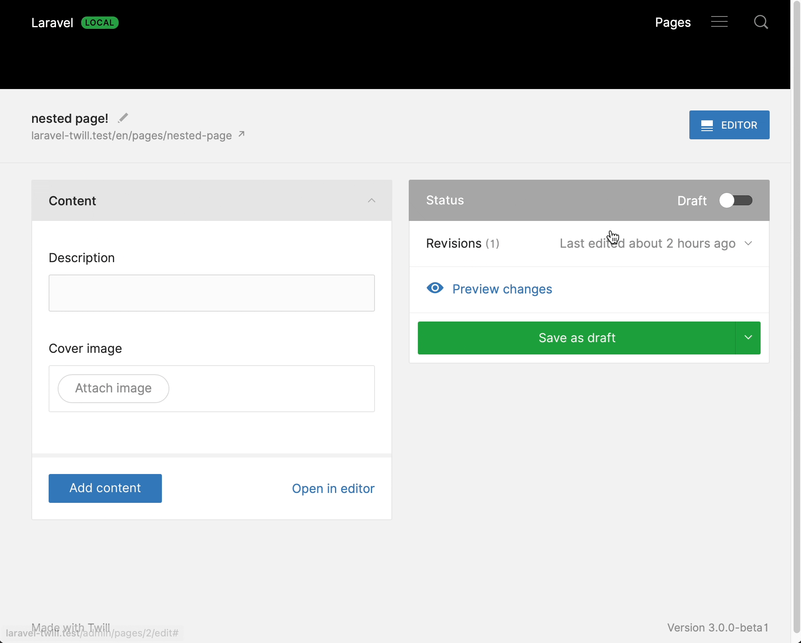

# Creating a block

Now that we have a block editor on the page module. We can start creating some custom blocks.

By default, Twill provides 2 basic blocks:

- There is a image block
- And a wysiwyg block

It is up to you to decide if you want to keep these enabled or disable them. For this guide we will disable them and
create our own custom blocks:

- A title and text block
- A basic image block

### Disable default blocks

To disable the default blocks, we have to remove them from the configuration.

Open up `config/twill.php` and add a `block_editor` key like this:

```php
<?php

return [
    'block_editor' => [
        'use_twill_blocks' => [],
    ]
]
```

If you now go back to the block editor and try to add a block you will see that there is nothing available. That's great
now we can go and create our own!

## Creating a title and text block

A basic block is just a single blade file in the `resources/views/twill/block` directory. It does have some annotations
at the top that helps Twill understand your block a bit better.

To create a block, we can use the artisan command `php artisan twill:make:block` followed by the name of the block.

Let's make a block that has a title and body. We will call it `text`.

`php artisan twill:make:block text`

It will ask us `Should we also generate a view file for rendering the block?`, as this will make it easier usually you 
will want to answer *yes*.

Now that the block has been created, open up `resources/views/twill/blocks/text.blade.php` and it should look like this:

```blade
@twillBlockTitle('Text')
@twillBlockIcon('text')
@twillBlockGroup('app')

<x-twill::input
    name="title"
    label="Title"
    :translated="true"
/>

<x-twill::wysiwyg
    name="text"
    label="Text"
    placeholder="Text"
    :toolbar-options="[
        'bold',
        'italic',
        ['list' => 'bullet'],
        ['list' => 'ordered'],
        [ 'script' => 'super' ],
        [ 'script' => 'sub' ],
        'link',
        'clean'
    ]"
    :translated="true"
/>
```

The default stubs for blocks that Twill provides, already have a title and wysiwyg field. Pretty convenient!

You can modify this if you wish, but out of the box this does exactly what we want it to do. Now let's go back to the
browser and add a block to our page.

<!-- <div class="max-w-lg mx-auto"></div> -->


As you may have noticed, the preview does not show our content yet. That's normal because we have not added anything yet
in the preview file.

We can open the file from the message and make it print our content.

In `resources/views/site/blocks/text.blade.php` we can add the following:

```blade
<div class="prose">
    <h2>{{$block->translatedInput('title')}}</h2>
    {!! $block->translatedInput('text') !!}
</div>
```

As you can see we use `translatedInput`, this makes sure that the content shown is in the current Laravel locale. If a 
field is not translatable you should use `input` instead.

Now when you add the block and write some content, you will see that the title and text appear!

Let's make another block now for the image.

## Creating a basic image block

We will basically do the same as before, however, this time we will have to update the block form as we do not enter 
text but we attach a media field instead.

`php artisan twill:make:block image`

And again we answer yes to the preview. But this time, we update the block to have the following:

```blade
@twillBlockTitle('Image')
@twillBlockIcon('text')
@twillBlockGroup('app')

<x-twill::medias
    name="highlight"
    label="Highlight"
/>
```

And if you remember from earlier in the guide, if we add a media field, we have to make sure that there is a role/crop
configuration for it!

We also mentioned before that for blocks, we do need a slightly different configuration. Let's add a block image role
to `config/twill.php`:

```php
<?php

return [
    'block_editor' => [
        'use_twill_blocks' => [],
        'crops' => [ // [tl! add:start]
            'highlight' => [
                'desktop' => [
                    [
                        'name' => 'desktop',
                        'ratio' => 16 / 9,
                    ],
                ],
                'mobile' => [
                    [
                        'name' => 'mobile',
                        'ratio' => 1,
                    ],
                ],
            ],
        ],// [tl! add:end]
    ],
];
```

Now with this in place, you can go back to the block editor and add your first image block! But just as before, we have
to update the content of the preview file (`resources/views/site/blocks/text.blade.php`) so that we actually display 
the image!

```blade
<div class="py-8 mx-auto max-w-2xl flex items-center">
    image('highlight', 'desktop')}}"/>
</div>
```

Great! That should give you plenty of flexibility to play around and create more blocks.
