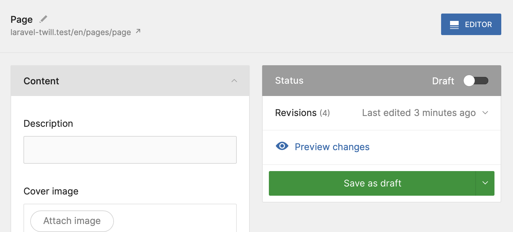
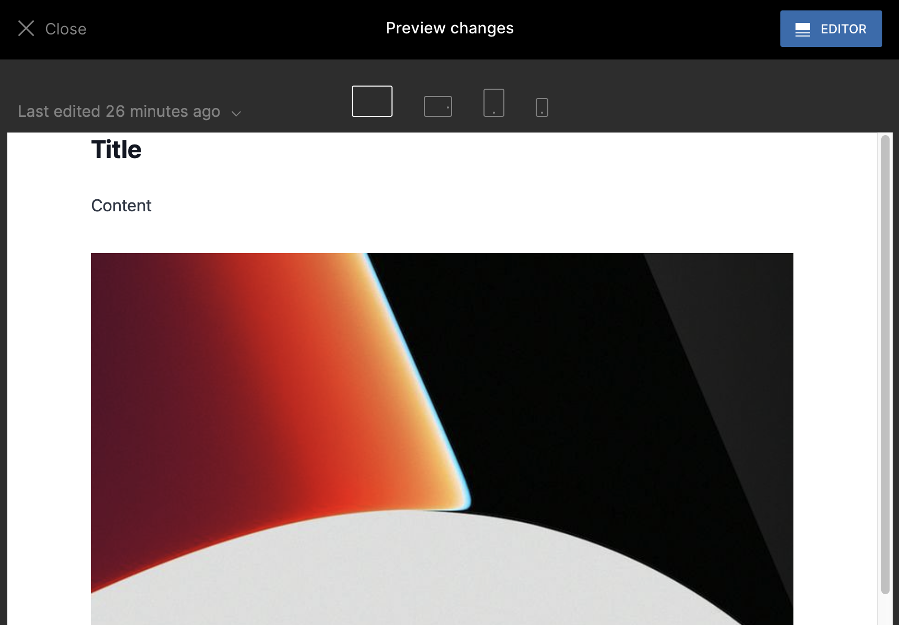

# Fixing the preview

You may already have noticed that when you are on the edit page, on the right side in the publishers panel there is a
link to preview the changes.



If you click on it now, you will see the default preview file that Twill generates for you when you made the module.

We will do a few things to make that work, and this will also be the basis for the front-end we will build later on.

If you are already experienced with blade, some approaches in this guide may sound suboptimal. That's true, because the
focus of this guide is not to spend too much time on abstracting the blade files into components, but rather to do the
basics to make the front-end work.

## Install Tailwind CSS

Tailwind CSS is entirely optional, you are free to use whatever you prefer, but as we are building a full site, we chose
to use Tailwind CSS.

We will not add much here about how to install Tailwind CSS, they have a 
[great Laravel guide](https://tailwindcss.com/docs/guides/laravel) that we suggest you follow.

Once that is complete, also add the [typography plugin](https://tailwindcss.com/docs/typography-plugin).

Once the installation is complete, we will add `@vite('resources/css/app.css')` to our block and preview files.

Open up `resources/views/site/page.blade.php` and update it to the following:

```blade
<!doctype html>
<html lang="en">
<head>
    <title>Demo page</title>
    @vite('resources/css/app.css') <!-- [tl! add] -->
</head>
<body>
<div>
    Example preview. See <a href="https://twillcms.com/docs/modules/revisions-and-previewing.html">documentation.</a>
    <br />
    {{ $item->title }}
    <br />
    {{ $item->description }}
</div>
</body>
</html>
```

Then edit `resources/views/site/layouts/block.blade.php` and update it:

```blade
<!doctype html>
<html lang="en">
<head>
    <title>#madewithtwill website</title>
    @vite('resources/css/app.css') <!-- [tl! add] -->
</head>
<body>
<div>
    @yield('content')
</div>
</body>
</html>
```

Now, when you are running `npm run dev` (or build once using `npm run build`) and you go back to the block editor, you
should already see some changes! This is because in the **creating blocks** section of this guide we already added
some styles.

## Update the preview template

We already touched it briefly in the previous step, but let's open up `resources/views/site/page.blade.php` again, as we
need to make some changes here!

1. We will update the title to use the actual title of our page.
2. We will render our blocks in the main div.
3. Add a bit of style to the main div so our content is nicely centered.

```blade
<!doctype html>
<html lang="en">
<head>
    <title>{{ $item->title }}</title><!-- [tl! highlight] -->
    @vite('resources/css/app.css')
</head>
<body>
<div class="mx-auto max-w-2xl"><!-- [tl! highlight] -->
    {!! $item->renderBlocks() !!}<!-- [tl! highlight] -->
</div>
</body>
</html>
```

Great. Once more click on the preview button, that should look a lot better!



That's it for this section. Our CMS part should now be fully functional.

All we have left now is to build our front-end!


