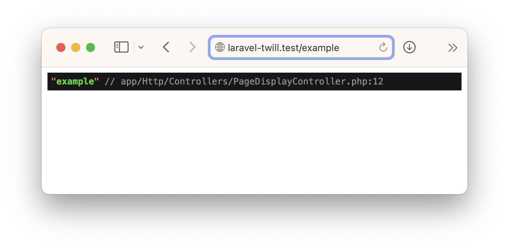

# Building a front-end

There are many ways in Laravel to build your front-end. For this guide we will use regular Blade, but since Twill is
headless, you can choose any technology you want:

- A vue/react/.. front-end that communicates over an API
- Inertia
- Livewire
- ...

We are using Blade for this guide as it does not require us to build an API and no build phase (except for Tailwind CSS)
.

So, let's get started!

## Route and controller

In Laravel a common approach is to use a combination of [routes](https://laravel.com/docs/10.x/routing) and
[controllers](https://laravel.com/docs/10.x/controllers) to build a front-end.

Routes are responsible for making the connection between the url in the browser and a controller.

Controllers take care of taking the information from the route, and return the response.

In this project, the setup will be rather easy, we will have 1 route that connects to 1 controller, and that is all we
need to make our page module work.

As with many things, we can use a command to generate a controller, however, the route will need to be created manually.

### Creating the controller

First, we will start with the controller. To create one we can use `make:controller`:

```shell
php artisan make:controller PageDisplayController
```

This will create the following file `app/Http/Controllers/PageDisplayController.php`:

```php
<?php

namespace App\Http\Controllers;

use Illuminate\Http\Request;

class PageDisplayController extends Controller
{
    //
}
```

It is blank by default, that's fine, let's add a method:

```phptorch
{
    "diffMethods": "show",
    "diffImports": "Illuminate\\Contracts\\View\\View"
}
##CODE##
<?php

namespace App\Http\Controllers;

use Illuminate\Contracts\View\View;
use Illuminate\Http\Request;

class PageDisplayController extends Controller
{
    public function show(string $slug): View
    {
        dd($slug);
    }
}
```

We added a show method, that takes a slug as argument. Inside we [dd](https://laravel.com/docs/10.x/helpers#method-dd)
the slug. `dd()` is short for Die and Dump. It takes the argument(s), prints them (pretty) and then kills the process.
It is useful to quickly figure something out or check if something is working.

With this in place, we can create a route!

### Creating the route

As we are building a website, we have to add a route to `routes/web.php`. Let's open this file and remove the original
content and replace it with our route:

```php
<?php

use Illuminate\Support\Facades\Route;

/*
|--------------------------------------------------------------------------
| Web Routes
|--------------------------------------------------------------------------
|
| Here is where you can register web routes for your application. These
| routes are loaded by the RouteServiceProvider within a group which
| contains the "web" middleware group. Now create something great!
|
*/

Route::get('/', function () { // [tl! remove:start]
    return view('welcome');
});// [tl! remove:end]
Route::get('{slug}', [\App\Http\Controllers\PageDisplayController::class, 'show'])->name('frontend.page'); // [tl! ++]
```

As you can see, we create a **get** route, that has **{slug}** as uri. Our second argument is our callable. This we
could have also written as 'PageDisplayController@show'. However, by using a proper namespace, it is easier to follow.

Once you save this file, head to your browser and visit: `https://your-local-domain.test/example`

If everything is correct, you will see the following:



And that is perfect, it is a good illustration on how we can use `dd` to make sure something is as we expect.

Now before we continue, remember in [configuring the page module](./5_configuring-the-page-module.md) that we already
cleaned up the permalink and language prefix.

Create a page in the CMS, and set the slug to `example` (or anything else, just remember it as we will use this in the
rest of this guide.)

### Rendering the page

Previously, we already setup a preview file for our page module that does the rendering of our blocks. This is perfect 
as we are building everything in blade, we can simply reuse that file for our front-end as well!

We will dive back into the `PageDisplayController` that we created before and we will get our page if we have one.

```phptorch
{
    "focusMethods": "show"
}
##CODE##
<?php

namespace App\Http\Controllers;

use App\Repositories\PageRepository;
use Illuminate\Contracts\View\View;

class PageDisplayController extends Controller
{
    public function show(string $slug, PageRepository $pageRepository): View
    {
        $page = $pageRepository->forSlug($slug);

        if (!$page) {
            abort(404);
        }

        return view('site.page', ['item' => $page]);
    }
}
```

Let's break it down a little bit.

- We added `PageRepository $pageRepository` to our arguments, this will be automatically injected by Laravel.
This repository is provided by Twill and provides some useful methods like `forSlug` that we will use.
- `$page = $pageRepository->forSlug($slug);` here we ask our repository for a page with the given slug. Internally this
checks if the page is published. So if you do not see your page when you refresh the browser, it might be because it is
still in draft mode!
- `if (!$page) { abort(404); }`, this is just a double check, if the repository did not give us a result, it means that 
the page does not exist or is not published, in this case we want to display a 404 page.
- Finally we `return view('site.page', ['item' => $page]);` return our view file and set the item to the one we fetched
from the repository! `item` in the data array corresponds to `$item` in our blade file.

And that is it, we can now display all the pages by using the slug in the url!

Now, we cannot tell our site visitors to guess the urls. Perhaps we need to 
[add some navigation](9_adding-navigation.md)?

