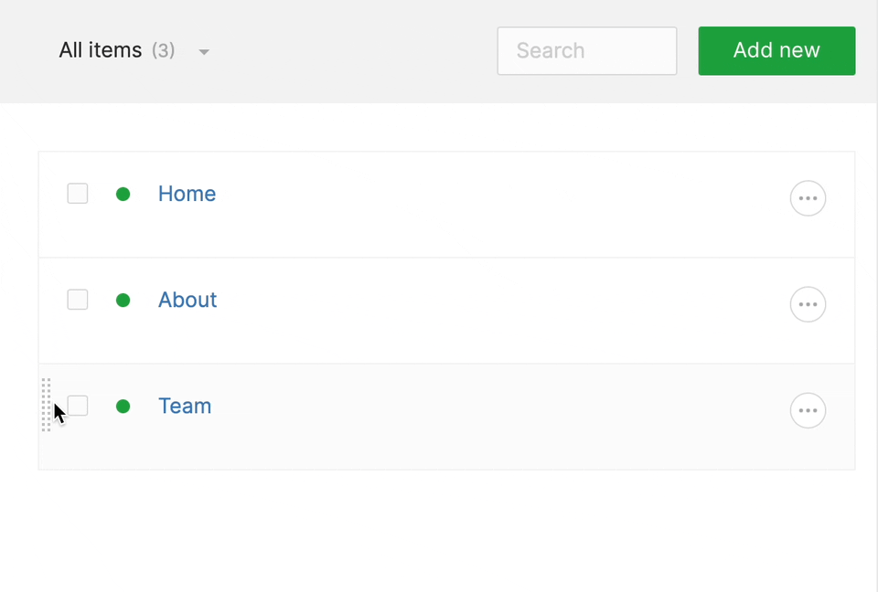

# Adding navigation

Now that we have all the pieces in our cms and front-end, we are missing one crucial thing, and that is our menu!

Once again, there are many ways to build a menu, but for this case, we will add a simple, self-nested module to do the
job.

We will go a bit faster now, as we already touched on many aspects, so let's dive right in!

## Generating the module

We can generate a self-nested module using:

`php artisan twill:make:module MenuLinks --hasNesting --hasPosition --hasTranslation`

To all other questions we will answer **no**.

Perfect.

Once again, we add the NavigationLink as provided in our `app/Providers/AppServiceProvider.php`, but this time, we
change the title to make a bit more sense.

```phptorch
{
  "collapseAll": "",
  "focusMethods": "boot",
  "diffInMethod": {
    "method": "boot",
    "start": 4,
    "end": 6
  }
}
##CODE##
<?php

namespace App\Providers;

use Illuminate\Support\ServiceProvider;
use A17\Twill\Facades\TwillNavigation;
use A17\Twill\View\Components\Navigation\NavigationLink;

class AppServiceProvider extends ServiceProvider
{
    public function boot()
    {
        TwillNavigation::addLink(
            NavigationLink::make()->forModule('pages')
        );
        TwillNavigation::addLink(
            NavigationLink::make()->forModule('menuLinks')->title('Menu')
        );
    }
}
```

We do not need a description in this module, so we can open up the migration and remove that:

```php
<?php

use Illuminate\Database\Migrations\Migration;
use Illuminate\Database\Schema\Blueprint;
use Illuminate\Support\Facades\Schema;

class CreateMenuLinksTables extends Migration
{
    public function up()
    {
        Schema::create('menu_links', function (Blueprint $table) {
            createDefaultTableFields($table);

            $table->string('title', 200)->nullable();

            $table->text('description')->nullable(); // [tl! --]
 // [tl! --]
            $table->integer('position')->unsigned()->nullable();

            $table->nestedSet();
        });
    }

    public function down()
    {
        Schema::dropIfExists('menu_links');
    }
}
```

Now you can run the migration: `php artisan migrate`

:::alert=type.warning:::
There are also references to `description` in:

- `app/Models/MenuLink.php`
- `app/Http/Controllers/Twill/MenuLinkController.php`

These will need to be removed as well.

Your files should look like this:

:::tabs=currenttab.model&items.model|controller:::
:::tab=name.model:::

```php
<?php

namespace App\Models;

use A17\Twill\Models\Behaviors\HasPosition;
use A17\Twill\Models\Behaviors\HasNesting;
use A17\Twill\Models\Behaviors\Sortable;
use A17\Twill\Models\Model;

class MenuLink extends Model implements Sortable
{
    use HasPosition, HasNesting;

    protected $fillable = [
        'published',
        'title',
        'position',
    ];
}
```

:::#tab:::
:::tab=name.controller:::

```php
<?php

namespace App\Http\Controllers\Twill;

use A17\Twill\Models\Contracts\TwillModelContract;
use A17\Twill\Services\Forms\Form;
use A17\Twill\Http\Controllers\Admin\NestedModuleController as BaseModuleController;

class MenuLinkController extends BaseModuleController
{
    protected $moduleName = 'menuLinks';
    protected $showOnlyParentItemsInBrowsers = true;
    protected $nestedItemsDepth = 1;

    protected function setUpController(): void
    {
        $this->disablePermalink();
        $this->enableReorder();
    }

    public function getForm(TwillModelContract $model): Form
    {
        $form = parent::getForm($model);

        return $form;
    }
}
```

:::#tab:::
:::#tabs:::
:::#alert:::

Now with all this in place, head back over to the CMS, click Menu in the top bar and add a first link, once it is
created, you will notice, there is no way for us to refer to one of our pages! Let's fix that!

## Adding a browser field

We will use a simple Twill managed [browser field](../../1_docs/4_form-fields/browser.md). A browser field is
an easy way to make a connection to another model.

In this case, every menu link will have a link to a page so that we know what we should link to.

### Implement HasRelated for the model

In our menu link model, we need to add the `HasRelated` trait:

```phptorch
{
  "diffImports": "A17\\Twill\\Models\\Behaviors\\HasRelated",
  "diffTraits": "A17\\Twill\\Models\\Behaviors\\HasRelated"
}
##CODE##
<?php

namespace App\Models;

use A17\Twill\Models\Behaviors\HasPosition;
use A17\Twill\Models\Behaviors\HasNesting;
use A17\Twill\Models\Behaviors\HasRelated;
use A17\Twill\Models\Behaviors\Sortable;
use A17\Twill\Models\Model;

class MenuLink extends Model implements Sortable
{
    use HasPosition;
    use HasNesting;
    use HasRelated;

    protected $fillable = [
        'published',
        'title',
        'position',
    ];
}
```

And in our module repository we tell Twill what related browsers it has to manage:

```phptorch
{
  "diffProperties": "relatedBrowsers",
  "focusProperties": "relatedBrowsers"
}
##CODE##
<?php

namespace App\Repositories;

use A17\Twill\Repositories\Behaviors\HandleNesting;
use A17\Twill\Repositories\ModuleRepository;
use App\Models\MenuLink;

class MenuLinkRepository extends ModuleRepository
{
    protected $relatedBrowsers = ['page'];
    
    use HandleNesting;

    public function __construct(MenuLink $model)
    {
        $this->model = $model;
    }
}
```

### Add the form field to the controller

In our menu link module controller we now add the form field:

```phptorch
{
  "collapseAll": "",
  "diffImports": "A17\\Twill\\Services\\Forms\\Fields\\Browser",
  "focusImports": "A17\\Twill\\Services\\Forms\\Fields\\Browser",
  "focusMethods": "getForm",
  "diffInMethod": {
    "method": "getForm",
    "start": 3,
    "end": 3
  }
}
##CODE##
<?php

namespace App\Http\Controllers\Twill;

use A17\Twill\Models\Contracts\TwillModelContract;
use A17\Twill\Services\Forms\Fields\Browser;
use A17\Twill\Services\Forms\Form;
use A17\Twill\Http\Controllers\Admin\NestedModuleController as BaseModuleController;
use App\Models\Page;

class MenuLinkController extends BaseModuleController
{
    protected $moduleName = 'menuLinks';
    protected $showOnlyParentItemsInBrowsers = true;
    protected $nestedItemsDepth = 1;

    protected function setUpController(): void
    {
        $this->disablePermalink();
        $this->enableReorder();
    }

    public function getForm(TwillModelContract $model): Form
    {
        $form = parent::getForm($model);

        $form->add(Browser::make()->name('page')->modules([Page::class]));

        return $form;
    }
}
```

As we are using the basic related table, we do not need to write a migration, that's pretty convenient. But if you want
or need a real relation, make sure to check the documentation as that is possible!

Perfect, we have our full setup now! If you head back into the CMS you can add a new menu item and link it to a page.

Now let's render it!

## Rendering the menu using a component

We want to be able to put the navigation into any area on our website. For this we will make a blade component that will
hold the menu.

A blade component is a blade file with an optional class file. For this case, we will use the blade + class file as the
class file will hold our php logic, and the blade file will do the rendering.

Again, we can use a command to do most of the work: `php artisan make:component Menu`

This will generate the class `app/View/Components/Menu.php` and the blade file `resources/views/components/menu.php`.

### Preparing the tree

We will first write the code for the menu. Before we do that, go back to the CMS and add some pages and links so we have
a nested structure. You can use the drag handle on the left of the content table to put things into the correct
position.

Like this:



This will help us during development as we will be able to see if things actually work.

### Gathering the data

Now, let's open up the component class `app/View/Components/Menu.php`, we will see an empty constructor and a render
method.

While in theory we can make it so we can have this nested to infinity, for this guide we will render just the top level
and their children.

In the render method we will add the code required for us to render the tree:

```phptorch
{
  "diffMethods": "render"
}
##CODE##
<?php

namespace App\View\Components;

use App\Models\MenuLink;
use Illuminate\Contracts\View\View;
use Illuminate\View\Component;

class Menu extends Component
{
    public function render(): View
    {
        /** @var MenuLink[] $links */
        $links = MenuLink::published()->get()->toTree();

        return view('components.menu', ['links' => $links]);
    }
}
```

So what we do here is requirest the tree of published menu links, then we send it to our components view file as "links"
.

This will expose the `$links` variable to the blade file that we will now write.

### Tree rendering markup

Now that we have the necessary data in our blade file, we can write the markup.

We will change the contents of `resources/views/components/menu.php` to this:

```phptorch
{
  "file": "../../../../examples/basic-page-builder/resources/views/components/menu.blade.php"
}
```

We add just a minimal amount of styling as we will not spend too much time on that during this guide. But this will
build a navigation tree that is slightly indented so that you can see the proper structure. 

You cannot see it in action yet, for that we have to add the component to the main template file.

### Adding the component to our page view

The final step for the menu, adding the component to the page view.

In reality, you might want to abstract your "layout" into a separate component as well, because if the amount of content
types will grow, this would require more maintenance to put the menu in every view.

But, for this guide, we will simply open `resources/views/site/page.blade.php` and add the menu:

```blade
<!doctype html>
<html lang="en">
<head>
    <title>{{ $item->title }}</title>
    @vite('resources/css/app.css')
</head>
<body>
<x-menu/> <!-- [tl! ++] -->
<div class="mx-auto max-w-2xl">
    {!! $item->renderBlocks() !!}
</div>
</body>
</html>

```

Wherever you will put `<x-menu/>` it will render the menu. That's useful because you could use it in a footer as well.

Now that we have pages and a menu, we have one last thing we need to do.

[We need a frontpage](./10_setup-the-frontpage.md)!

