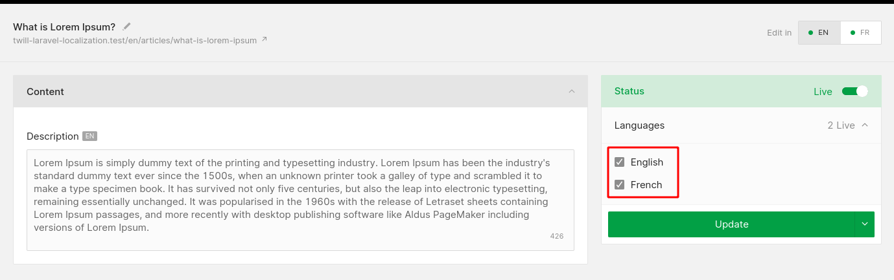

# Building a multilingual site with Laravel Localization

This is a step by step recipe for installing and configuring
the [Laravel Localization](https://github.com/mcamara/laravel-localization) package in a Twill project.

Objectives:

- Configure Twill for multilingual content management
- Install and configure Laravel Localization
- Create an 'articles' module and build a simple frontend for it

## Configure Twill

In this example, we'll be configuring a site in English and French. Out of the box, Twill is configured for English by
default. Let's add French as a secondary language:

`config/translatable.php`

```php
    'locales' => [
        'en',
        'fr',
    ],
```

## Create the articles module

Make sure to enable translations and slugs. The rest is entirely optional:

```
php artisan twill:make:module -TS articles
```

For simplicity, keep the default title and description fields.

Then, run the migrations, add the module to `routes/admin.php` and to `twill-navigation.php`.

## Create your content

On the Twill side, nothing else is needed. When creating an article, you can edit your content in both languages using
the language selector. After editing a record, make sure to mark all languages as "Live":



## Install Laravel Localization

Install the package in your project via composer:

```
composer require mcamara/laravel-localization
```

Then publish the configuration file:

```
php artisan vendor:publish --provider="Mcamara\LaravelLocalization\LaravelLocalizationServiceProvider"
```

This will create the file: `config/laravellocalization.php`

## Configure Laravel Localization

Like Twill, the package is configured for English by default. A large number of languages are made available in
the `supportedLocales` array. Let's uncomment the line for French:

`config/laravellocalization.php`

```php
    'supportedLocales' => [
        'en' => ['name' => 'English', 'script' => 'Latn', 'native' => 'English', 'regional' => 'en_GB'],
        'fr' => ['name' => 'French', 'script' => 'Latn', 'native' => 'franais', 'regional' => 'fr_FR'],
        // ... other unused languages can remain commented ...
    ],
```

For this example, nothing else needs to be customized in this file.

## Configure Middleware

To enable the various localization features such as route translations, language detection and redirect, register the
package's middleware:

`app/Http/Kernel.php`

```php
    protected $routeMiddleware = [
        // ... built-in Laravel middleware (auth, cache, etc.) ...

        // Add the following middleware from Laravel Localization:
        'localize' => \Mcamara\LaravelLocalization\Middleware\LaravelLocalizationRoutes::class,
        'localizationRedirect' => \Mcamara\LaravelLocalization\Middleware\LaravelLocalizationRedirectFilter::class,
        'localeSessionRedirect' => \Mcamara\LaravelLocalization\Middleware\LocaleSessionRedirect::class,
        'localeCookieRedirect' => \Mcamara\LaravelLocalization\Middleware\LocaleCookieRedirect::class,
        'localeViewPath' => \Mcamara\LaravelLocalization\Middleware\LaravelLocalizationViewPath::class
    ];
```

## Frontend: Setup the index page

We'll create a basic index page to list all the news articles. Let's start with a `/news` route:

`routes/web.php`

```php
use App\Models\Article;

Route::group([
    'prefix' => LaravelLocalization::setLocale(),
    'middleware' => ['localize', 'localeSessionRedirect', 'localizationRedirect', 'localeViewPath'],
], function () {
    Route::get('news', function () {
        return view('site.articles.index', [
            'articles' => Article::published()->orderBy('created_at', 'desc')->get(),
        ]);
    })->name('articles');
});
```

Then, add a generic layout for all news pages:

```blade
<!DOCTYPE html>
<html lang="{{ str_replace('_', '-', app()->getLocale()) }}">
    <head>
        <meta charset="utf-8">
        <title>The News</title>
    </head>
    <body>
        <header>
            <ul>
                @foreach(LaravelLocalization::getSupportedLocales() as $localeCode => $properties)
                    <li>
                        <a 
                            rel="alternate" 
                            hreflang="{{ $localeCode }}" 
                            href="{{ LaravelLocalization::getLocalizedURL($localeCode, null, [], true) }}"
                        >
                            {{ strtoupper($localeCode) }}
                        </a>
                    </li>
                @endforeach
            </ul>
        </header>
        <main>
            @yield('content')
        </main>
    </body>
</html>
```

Then, add a template for the articles index page:

```blade
@extends('site.layouts.news')

@section('content')
    <h1>{{ __('news.all_news') }}</h1>

    @if ($articles->isNotEmpty())
        <ul>
            @foreach ($articles as $article)
                <li>
                    <a href="{{ route('article', $article->slug) }}">{{ $article->title }}</a>
                </li>
            @endforeach
        </ul>
    @else
        <p>{{ __('news.no_news') }}</p>
    @endif
@endsection
```

With this, we have a functioning language switcher.
Switching between languages should change the language code prefix in the URL.
The list of article titles should also follow the selected language. Let's keep going!

## Setup the single article page

Add the `/news/article-slug` route to the translated routes group defined earlier:

```php
use App\Models\Article;
use Illuminate\Support\Facades\Route;
use Illuminate\Support\Facades\Route;

Route::group([
    'prefix' => LaravelLocalization::setLocale(),
    'middleware' => ['localize', 'localeSessionRedirect', 'localizationRedirect', 'localeViewPath'],
], function () {
    Route::get('news', function () {
        return view('site.articles.index', [
            'articles' => Article::published()->orderBy('created_at', 'desc')->get(),
        ]);
    })->name('articles');

    Route::get('news/{article}', function (Article $article) { // [tl! focus:start]
        return view('site.articles.show', [
            'article' => $article,
        ]);
    })->name('article'); // [tl! focus:end]
});
```

Since we're trying to rely on Laravel's route-model binding, we must make a small addition to our `Article`
model to find the appropriate article by slug:

`app/Models/Article.php`

```phptorch
{
  "file": "./building_a_multilingual_site_with_twill_and_laravel_localization/Article.php",
  "focusMethods": "resolveRouteBinding"
}
```

## Finishing touches

We're making good progress, but there are a few problems with our current solution:

- The URL base is not translated (we get `/news` in both languages)
- Some static text is not translated ("All Articles", "Back", etc.)
- Our language switcher is not quite aware of the translated slugs (we get English slugs for the French link in the
  language switcher, and vice versa)

## Translate the base URL

To translate route segments, Laravel Localization uses standard Laravel language files. We'll create two new files for
our route translations in English and French:

`resources/lang/en/routes.php`

```php
<?php

return [
    'articles' => 'news',
    'article' => 'news/{article}',
];
```

`resources/lang/fr/routes.php`

```php
<?php

return [
    'articles' => 'actualites',
    'article' => 'actualites/{article}',
];
```

Then, we'll update our route definitions to make use of the `transRoute` helper instead of hardcoded values:

`routes/web.php`

```php 
use App\Models\Article;
use Illuminate\Support\Facades\Route;
use Mcamara\LaravelLocalization\Facades\LaravelLocalization;

Route::group([
    'prefix' => LaravelLocalization::setLocale(),
    'middleware' => ['localize', 'localeSessionRedirect', 'localizationRedirect', 'localeViewPath'],
], function () {
    Route::get(LaravelLocalization::transRoute('routes.articles'), function () {// [tl! focus]
        return view('site.articles.index', [
            'articles' => Article::published()->orderBy('created_at', 'desc')->get(),
        ]);
    })->name('articles');

    Route::get(LaravelLocalization::transRoute('routes.article'), function (Article $article) { // [tl! focus]
        return view('site.articles.show', [
            'article' => $article,
        ]);
    })->name('article');
});
```

## Translate static text

As alluded to before, the same method can be used to translate our static text. We'll create two additional files for
our text translations in English and French:

`resources/lang/en/news.php`

```php
<?php

return [
    'all_news' => 'All Articles',
    'no_news' => 'Nothing here :(',
    'back' => 'Back',
];
```

`resources/lang/fr/news.php`

```php
<?php

return [
    'all_news' => 'Tous les articles',
    'no_news' => 'Rien ici :(',
    'back' => 'Retour',
];
```

## Fix the language switcher

Because we're using route-model binding, all that's needed to fix our language switcher issue is to implement
the `LocalizedUrlRoutable` interface from Laravel Localization in our model. For this, we'll add a new method:

`app/Models/Article.php`

```phptorch
{
  "file": "./building_a_multilingual_site_with_twill_and_laravel_localization/Article.php",
  "focusMethods": "getLocalizedRouteKey"
}
```

And there we have it, a fully translated frontend! The articles index URLs are:

- http://example.com/en/news
- http://example.com/fr/actualites

and the single article URLs will look like:

- http://example.com/en/news/the-article-slug
- http://example.com/fr/actualites/le-slug-de-l-article

## Where to go from here?

#### Explore configuration options

The `config/laravellocalization.php` file contains a few more options that can be customized. One of the most useful is
probably `hideDefaultLocaleInURL`, which can be used to hide the language prefix from the URLs for your default
language (`/en`, in this example).

Similarly, the `config/translatable.php` file published by Twill can be customized.

Twill's own UI has also been translated in multiple languages. This can be configured in `config/twill.php`:

```php
<?php

return [
    'locale' => 'fr',
    'fallback_locale' => 'en',
    //...
];
```

#### Handle inactive languages

In this example, all articles are shown on the index page, regardless of their active state ("Live" checkbox in the CMS)
. Filtering articles on the "active" property is a simple way to hide inactive article translations:

`routes/web.php`

```php
    Route::get(LaravelLocalization::transRoute('routes.articles'), function () {
        return view('site.articles.index', [
            'articles' => Article::published()->orderBy('created_at', 'desc')->get()
                ->filter(function ($article) { return $article->active; }),
        ]);
    })->name('articles');
```

From the `HasTranslation` model behavior, the `hasActiveTranslation()` method can be used to check if a given article
has an active translation for a given locale. To check against the current locale:

```php
$isActive = $article->hasActiveTranslation(app()->getLocale());
```

This way, you can decide what to do when a user tries to access an inactive translation (e.g. redirect to another
language, redirect to the index page, trigger a 404, etc.)

#### Redirect old slugs

Out of the box, every time a slug is changed for a given article in the CMS, Twill keeps a record of the old slug in
the `article_slugs` table. We can leverage this to conveniently redirect our users (and search engine crawlers ;) to the
most up to date URL:

`routes/web.php`

```php
    Route::get(LaravelLocalization::transRoute('routes.article'), function (Article $article) {
        if ($article->redirect) {
            if ($article->hasActiveTranslation(app()->getLocale())) {
                return redirect(route('article', $article->slug));
            }
            abort(404);
        }

        return view('site.articles.show', [
            'article' => $article,
        ]);
    })->name('article');
```
