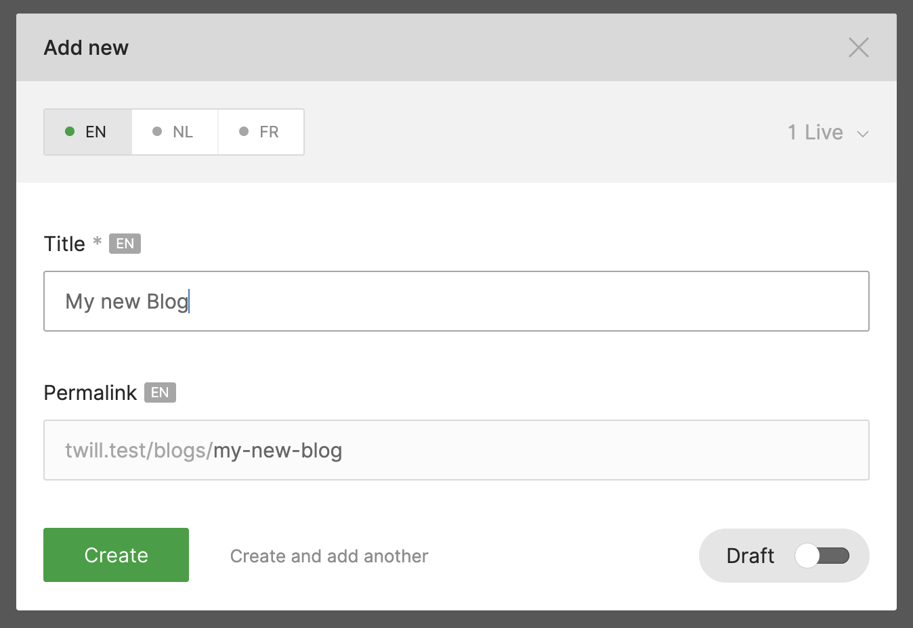
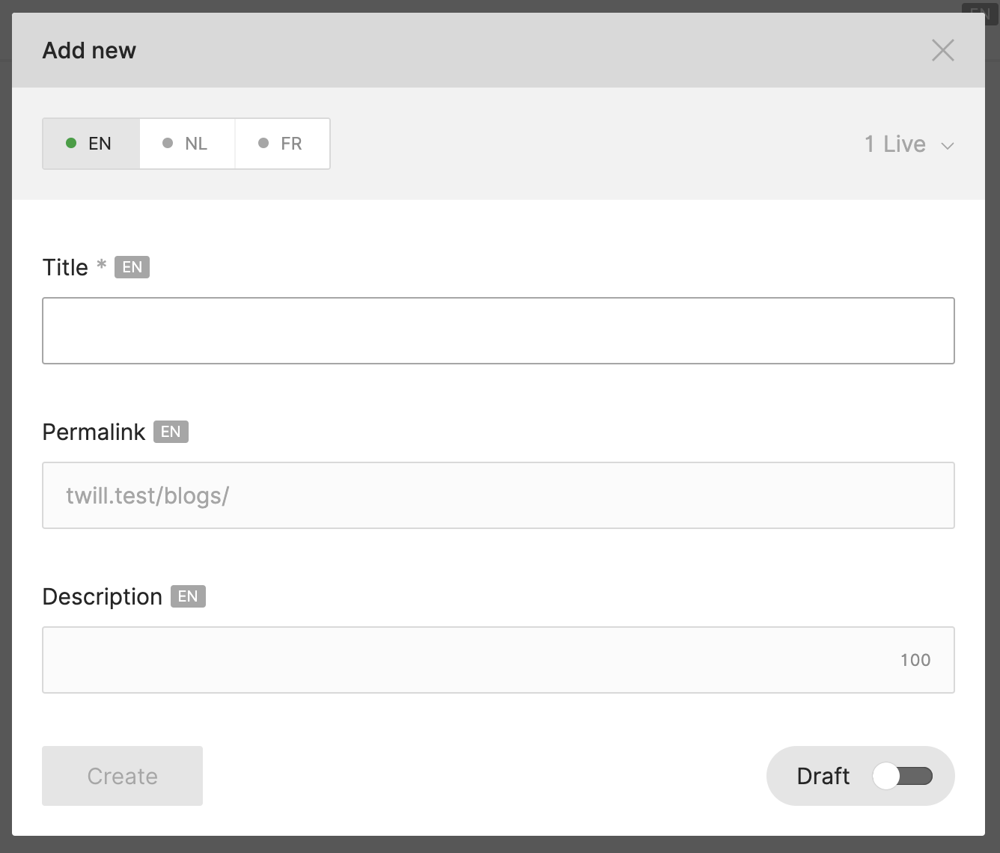
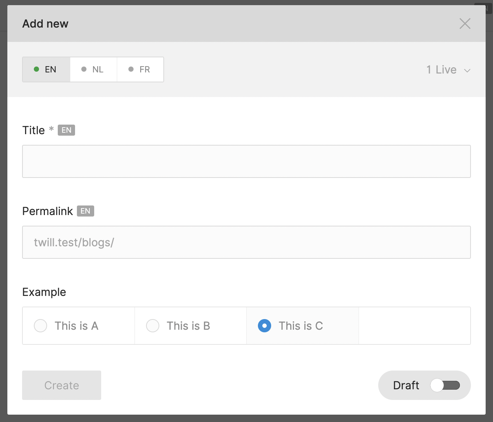

# Adding fields to the create modal

The default create modal has a field for the title and slug along with some publication settings:



Often you might want to add some mandatory fields to the create modal of your modules.



## How to customize

:::tabs=currenttab.FormBuilder&items.FormBuilder|FormView:::
:::tab=name.FormBuilder:::

In our module controller we can override the `getCreateForm` method and add the fields to render:

:::filename:::
`app/Http/Controllers/Twill/YourModuleController.php`
:::#filename:::

```phptorch
{
  "focusMethods": "getCreateForm"
}
##CODE##
<?php

namespace App\Http\Controllers\Twill;

use A17\Twill\Http\Controllers\Admin\NestedModuleController as BaseModuleController;
use A17\Twill\Services\Forms\Fields\Input;
use A17\Twill\Services\Forms\Fields\Wysiwyg;
use A17\Twill\Services\Forms\Form;

class BlogController extends BaseModuleController
{
    protected $moduleName = 'blogs';

    public function getCreateForm(): Form
    {
        return Form::make([
            Input::make()
                ->name('title')
                ->label('My title field')
                ->translatable()
                ->onChange('formatPermalink'),
            Wysiwyg::make()
                ->name('description')
                ->label('Descrription')
                ->translatable(),
            Input::make()
                ->name('slug')
                ->label(twillTrans('twill::lang.modal.permalink-field'))
                ->translatable()
                ->ref('permalink')
                ->prefix($this->getPermalinkPrefix($this->getPermalinkBaseUrl())),
        ]);
    }

}
```

In this example we added the necessary fields to keep the title and slug work. We recommend to keep
these unless they are not required.

:::#tab:::
:::tab=name.FormView:::
To customize the contents of the create modal we can add a `create.blade.php` next to the `form.blade.php` file.

There is 2 ways we can go about this, the first and usually preferred way is to extend from the default create file,
this
will ensure that also with future updates you stay in line with the Twill defaults

```blade
@include('twill::partials.create')

<x-twill::input
    name="description"
    label="description"
    :translated="true"
    :maxlength="100"
/>
```

#### Customize with more control

Alternatively you can go completely custom, and to reproduce the same outcome as above you can use the example below.

The benefit of this is that you have more control over the positioning and you could move the description field above
the permalink for example.

```blade
<x-twill::input
    :name="$titleFormKey ?? 'title'"
    :label="$titleFormKey === 'title' ? twillTrans('twill::lang.modal.title-field') : ucfirst($titleFormKey)"
    :translated="$translateTitle ?? false"
    :required="true"
    on-change="formatPermalink"
/>

<x-twill::input
    name="description"
    label="Description"
    :translated="true"
    :maxlength="100"
/>

@if ($permalink ?? true)
    <x-twill::input
        name="slug"
        :label="twillTrans('twill::lang.modal.permalink-field')"
        :translated="true"
        ref="permalink"
        :prefix="$permalinkPrefix ?? ''"
    />
@endif
```

#### Providing data to the form

In some cases you might want to add a select list based on dynamic values coming from the back-end.

To do this you can utilize the `indexData` method on the module controller.

```php
class BlogController extends BaseModuleController
{
    ...
    protected function indexData($request)
    {
        return [
            'example_options' => [
                [
                    'value' => 'a',
                    'label' => 'This is A',
                ],
                [
                    'value' => 'b',
                    'label' => 'This is B',
                ],
                [
                    'value' => 'c',
                    'label' => 'This is C',
                ],
            ],
        ];
    }
}
```

Then in your modules `create.blade.php` file you can use:

```blade
@include('twill::partials.create')

<x-twill::select
    name="example_options_field"
    label="Example"
    :unpack="true"
    :options="$example_options"
/>
```

Result:



:::#tab:::
:::#tabs:::
