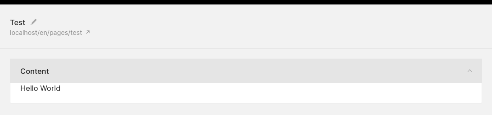
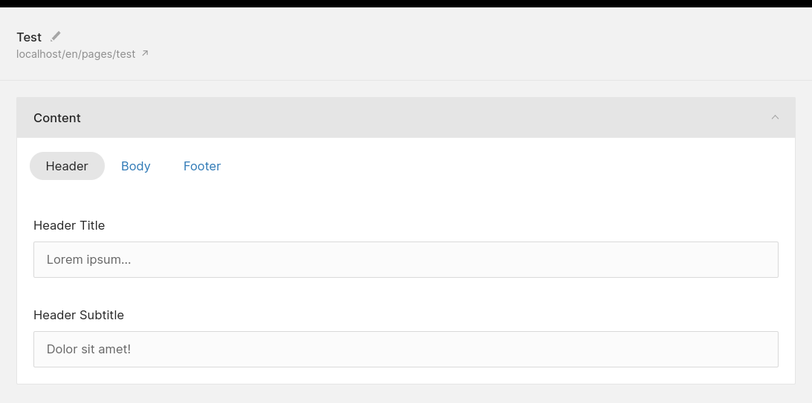
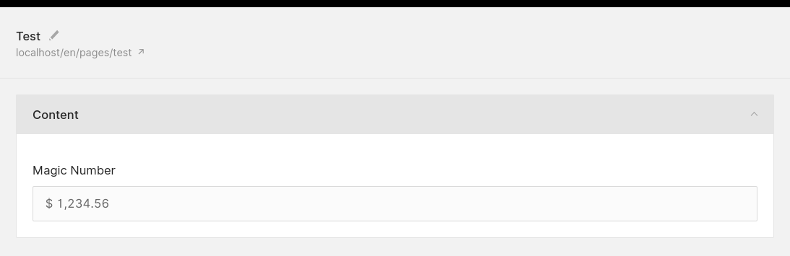
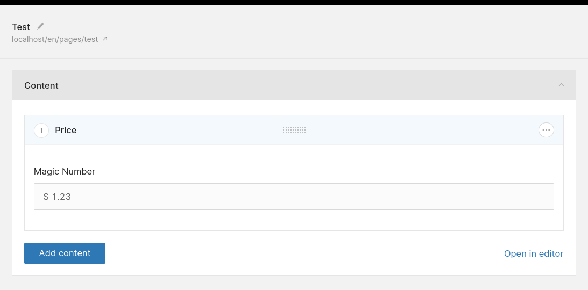
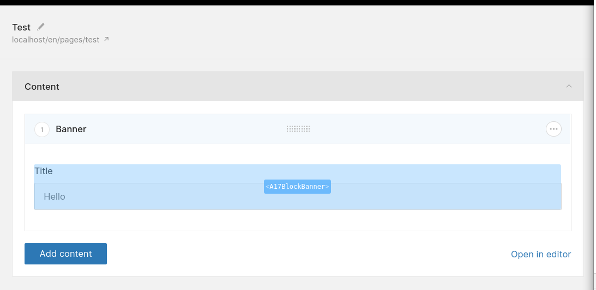

# Creating custom Vue.js components, form fields and blocks

Objectives:

- Get an overview of Twill's Artisan commands for development
- Create a custom Vue.js component
- Create a custom Twill form field
- Create a custom Twill block

## Part 1 - Setup Twill for development

If you have been working with Twill for some time, you may already be familiar with the `php artisan twill:update`
command. This command takes Twill's precompiled assets (JS, CSS, etc.) and copies them to your
project's `public/assets/admin` folder.

To develop custom Vue.js components for Twill, we can forget about `twill:update` and take control of the build step
with the following commands:

- `twill:build` -> Build Twill assets with custom Vue components/blocks
- `twill:dev` -> Hot reload Twill assets with custom Vue components/blocks

We'll start by creating a simple `HelloWorld` component and building it with `twill:build`.

You will need a module in your project to follow along. We'll use `pages` as an example in this text.

### Create a custom component

Create the following file in your project:

:::filename:::
`resources/assets/js/components/HelloWorld.vue`
:::#filename:::

```vue

<template>
  <!-- eslint-disable -->
  <div>
    Hello {{ name }}
  </div>
</template>

<script>
  /* eslint-disable */

  export default {
    props: ['name']
  }
</script>
```

Why `eslint-disable`? Twill's own build tools come with a pretty strict ESLint configuration out of the box. This
ensures a good internal consistency in the code of Twill's own components, but will give you an error if your components
don't follow Twill's formatting rules.

The `eslint-disable` comments allow you to bypass the formatting rules for your own components. Try it for yourself,
turn it on/off and see what you like!

### Build the new component

Run:

```
php artisan twill:build
```

This will start by installing Twill's NPM dependencies in `vendor/area17/twill/node_modules`. Twill will check if the
node_modules folder exist and if needed will run npm install. If you want to force npm install you can use:

```
php artisan twill:build --install
```

This is only for Twill's own dependencies, you don't need to modify what is being installed in there. For your own
dependencies in your custom components, you can run `npm install` directly into your project.

### Use the new component

When the build is done, you can use the new component in your forms:

:::filename:::
`resources/views/admin/pages/form.blade.php`
:::#filename:::

```blade
@extends('twill::layouts.form')

@section('contentFields')
<a17-hello-world name="World"></a17-hello-world>
@stop
```

In your markup, all custom components must have the `a17-` prefix. In my personal opinion, it's also best to use an
additional prefix for your components, such as `a17-custom-`. This will avoid all possible conflicts with Twill's
built-in components, which also share the `a17-` prefix.

The component in action:



### Introducing `twill:dev`

When developing components, you can take advantage of `twill:dev` for fast rebuilds,
hot reloading and auto refresh in the browser:

```
php artisan twill:dev
```

This will watch for changes in your `resources/assets/js` directory and rebuild accordingly.

**Note for Sail/Docker users** you may get the following error when running `twill:dev`:

```
Error: $SHELL environment variable is not set.
```

In this case, you can prefix the `twill:dev` command like this:

```
export SHELL=/usr/bin/bash && php artisan twill:dev
```

### Twill dev mode

After running `twill:dev`, you need to inform Twill that you are in development
mode by setting the following variables in your `.env` file:

```
TWILL_DEV_MODE=true
TWILL_DEV_MODE_URL="http://localhost:8080"
```

`TWILL_DEV_MODE_URL` is used by Twill to access the development assets through the hot reloading server. You don't need
to access this address in your browser, simply access your development site as before (e.g. http://my-app.test)

**For Valet users** the above configuration should work out of the box.

**For Homestead/Vagrant users** if you are running `twill:dev` inside of the VM, make sure to set `TWILL_DEV_MODE_URL`
to your actual development URL (e.g. `TWILL_DEV_MODE_URL="http://my-app.test:8080"`)

**For Sail/Docker users** if you are running `twill:dev` inside of the container, make sure to expose the `8080` port in
your `docker-compose.yml` or `Dockerfile` configuration.

## Part 2 - Custom component practical example

The `HelloWorld` component is obviously not very useful. Custom components can be used to add interactivity to your
Twill admin forms. Here's a more complete example of a `CustomTabs` component to organize your form fields in tabs:



This reuses a bit of CSS from other parts of Twill (ie. `.box__filter`).

### Vue.js component

:::filename:::
`resources/assets/js/components/CustomTabs.vue`
:::#filename:::

```vue

<template>
  <!-- eslint-disable -->
  <div class="custom-tabs">
    <ul class="box__filter">
      <li v-for="tab of tabs">
        <a
            href="#"
            :class="{ 's--on': activeTab === tab.name }"
            @click.prevent="activateTab(tab.name)"
        >
          {{ tab.label }}
        </a>
      </li>
    </ul>
    <slot></slot>
  </div>
</template>

<script>
  /* eslint-disable */

  export default {
    props: {
      tabs: { type: Array },
    },

    data () {
      return {
        activeTab: null
      }
    },

    mounted () {
      if (this.tabs.length > 0) {
        this.activateTab(this.tabs[0].name)
      }
    },

    methods: {
      activateTab (name) {
        this.$el.querySelectorAll('.custom-tab').forEach(tab => {
          tab.classList.remove('is-active')
        });

        const newActiveTab = this.$el.querySelector(`.custom-tab--${name}`)

        if (newActiveTab) {
          newActiveTab.classList.add('is-active')
          this.activeTab = name
        }
      }
    },
  }
</script>

<style scoped>
  .custom-tabs {
    margin-top: 7px;
  }

  .custom-tab {
    display: none;
  }

  .custom-tab.is-active {
    display: initial;
  }
</style>
```

### Usage in a form

:::filename:::
`resources/views/admin/pages/form.blade.php`
:::#filename:::

```blade
@extends('twill::layouts.form')

@section('contentFields')
    <a17-custom-tabs :tabs="[
        { name: 'header', label: 'Header' },
        { name: 'body', label: 'Body' },
        { name: 'footer', label: 'Footer' },
    ]">
        <div class="custom-tab custom-tab--header">
            <x-twill::input
                name="header_title"
                label="Header title"
                :translated="true"
            />
            
            <x-twill::input
                name="header_subtitle"
                label="Header subtitle"
                :translated="true"
            />
        </div>

        <div class="custom-tab custom-tab--body">
            <p>** Add body form fields here **</p>
        </div>

        <div class="custom-tab custom-tab--footer">
            <p>** Add footer form fields here **</p>
        </div>
    </a17-custom-tabs>
@stop
```

## Part 3 - Custom form field example

Form fields are at the core of the content management experience in any CMS. In Twill, form fields are usually made of 2
parts: a Vue.js component that hooks into Twill's Vuex store, and a Blade view that acts as an interface to this
component.

Here's a complete example of a `custom_number` form field, based on
the [vue-numeric](https://www.npmjs.com/package/vue-numeric) package:



### Install the dependency

```
npm install vue-numeric --save
```

### Vue.js component

:::filename:::
`resources/assets/js/components/CustomNumber.vue`
:::#filename:::

```vue

<template>
  <!-- eslint-disable -->
  <a17-inputframe
      :error="error"
      :note="note"
      :label="label"
      :name="name"
      :required="required"
  >
    <div class="form__field">
      <vue-numeric
          :precision="precision"
          :currency="currency"
          :decimal-separator="decimalSeparator"
          :thousand-separator="thousandSeparator"
          :name="name"
          v-model="value"
          @blur="onBlur"
      ></vue-numeric>
    </div>
  </a17-inputframe>
</template>

<script>
  /* eslint-disable */

  import InputMixin from '@/mixins/input'
  import FormStoreMixin from '@/mixins/formStore'
  import InputframeMixin from '@/mixins/inputFrame'

  import VueNumeric from 'vue-numeric'

  export default {
    mixins: [InputMixin, InputframeMixin, FormStoreMixin],

    components: { VueNumeric },

    props: {
      name: {
        type: String,
        required: true,
      },
      initialValue: {
        type: Number,
        default: 0,
      },
      precision: {
        type: Number,
        default: 2,
      },
      currency: {
        type: String,
        default: '$',
      },
      decimalSeparator: {
        type: String,
        default: '.',
      },
      thousandSeparator: {
        type: String,
        default: '',
      },
    },

    data () {
      return {
        value: this.initialValue,
      }
    },

    methods: {
      updateFromStore (newValue) {
        if (typeof newValue === 'undefined') newValue = ''

        if (this.value !== newValue) {
          this.value = newValue
        }
      },
      updateValue (newValue) {
        if (this.value !== newValue) {
          this.value = newValue

          this.saveIntoStore()
        }
      },
      onBlur (event) {
        const newValue = event.target.value
        this.updateValue(newValue)
      },
    },
  }
</script>

<style lang="scss" scoped>
  .form__field {
    display: flex;
    align-items: center;
    padding: 0 15px;
    overflow: visible;

    input {
      @include resetfield;
      width: 100%;
      height: 43px;
      line-height: 43px;
      color: inherit;
      padding: 0;
    }
  }
</style>
```

### Blade view

:::filename:::
`resources/views/admin/partials/form/_custom_number.blade.php`
:::#filename:::

```blade
@php
    $precision = $precision ?? '2';
    $currency = $currency ?? '$';
    $decimalSeparator = $decimalSeparator ?? '.';
    $thousandSeparator = $thousandSeparator ?? '';
@endphp

<a17-custom-number
    label="{{ $label }}"
    :precision="{{ $precision }}"
    currency="{{ $currency }}"
    decimal-separator="{{ $decimalSeparator }}"
    thousand-separator="{{ $thousandSeparator }}"
    @include('twill::partials.form.utils._field_name')
    in-store="value"
></a17-custom-number>

@unless($renderForBlocks || $renderForModal || (!isset($item->$name) && null == $formFieldsValue = getFormFieldsValue($form_fields, $name)))
@push('vuexStore')
    window['{{ config('twill.js_namespace') }}'].STORE.form.fields.push({
        name: '{{ $name }}',
        value: {!! json_encode($item->$name ?? $formFieldsValue) !!}
    })
@endpush
@endunless
```

### Usage in a form

:::filename:::
`resources/views/admin/pages/form.blade.php`
:::#filename:::

```blade
@extends('twill::layouts.form')

@section('contentFields')
    @formField('custom_number', [
        'name' => 'magic_number',
        'label' => 'Magic Number',
        'thousandSeparator' => ',',
    ])
@stop
```

### Digging deeper

This form field is functional but very limited, on purpose. For example, it is not translatable. At this time, the best
way to explore what's possible with form fields is to dig into Twill's built-in form components.

Here are a few good places to start exploring:

- [HiddenField.vue](https://github.com/area17/twill/blob/2.x/frontend/js/components/HiddenField.vue)  Possibly the
  simplest form field in Twill.
- [DatePicker.vue](https://github.com/area17/twill/blob/2.x/frontend/js/components/DatePicker.vue) A good example of
  form field that integrates with an external JS library.
- [TextField.vue](https://github.com/area17/twill/blob/2.x/frontend/js/components/Textfield.vue) A complex form field
  with translations and type variations.

## Part 4 - Custom block example

The first thing to say about custom Vue.js blocks is that you probably don't need them! Since Twill 2.0, custom blocks
can be created entirely with Blade views. The `twill:make:block` command can scaffold a Blade block for you:

```
php artisan twill:make:block banner
```

This will create the following file in your project:

:::filename:::
`resources/views/admin/blocks/banner.blade.php`
:::#filename:::

```blade
@twillBlockTitle('Banner')
@twillBlockIcon('text')
@twillBlockGroup('app')

<x-twill::input
    name="title"
    label="Title"
/>

// ...
```

You can add all of Twill's built-in form fields in your blocks, as well as any custom components and form fields that
you create. This is the reason why creating custom Vue.js blocks may not be necessary.

Here's an example of our `custom_number` field inside of a custom Blade block:



:::filename:::
`resources/views/admin/blocks/price.blade.php`
:::#filename:::

```blade
@twillBlockTitle('Price')
@twillBlockIcon('text')
@twillBlockGroup('app')

@formField('custom_number', [
    'name' => 'magic_number',
    'label' => 'Magic Number',
    'thousandSeparator' => ',',
])
```

Nevertheless, if you wish to explore custom Vue.js blocks, you can use the `twill:blocks` command to get going.

### Prepare your custom block

Add the `@twillBlockCompiled` directive to your Blade view:

:::filename:::
`resources/views/admin/blocks/banner.blade.php`
:::#filename:::

```blade
@twillBlockTitle('Banner')
@twillBlockIcon('text')
@twillBlockGroup('app')
@twillBlockCompiled('true')

// ...
```

Then run :

```
php artisan twill:blocks
```

This will create the following file in your project:

:::filename:::
`resources/assets/js/blocks/BlockBanner.vue`
:::#filename:::

```vue

<template>
  <!-- eslint-disable -->
  <div class="block__body">
    <a17-locale type="a17-textfield"
                :attributes="{ label: 'Title', name: fieldName('title'), type: 'text', inStore: 'value' }"></a17-locale>
  </div>
</template>

<script>
  import BlockMixin from '@/mixins/block'

  export default {
    mixins: [BlockMixin]
  }
</script>
```

This file is effectively your Blade template, rendered into a Vue.js component shell. How cool is that?

### Customize and build

From this point, you can customize the new Vue.js component in any way you want. Keep in mind that your custom block is
limited to the following area in the Block Editor (shown in blue):



When you are done, run:

```
php artisan twill:build
```

Then the custom block is usable in the block editor:

:::filename:::
`resources/views/admin/pages/form.blade.php`
:::#filename:::

```blade
@extends('twill::layouts.form')

@section('contentFields')
	// ...
    <x-twill::block-editor :blocks="['banner']"/>
@stop
```
