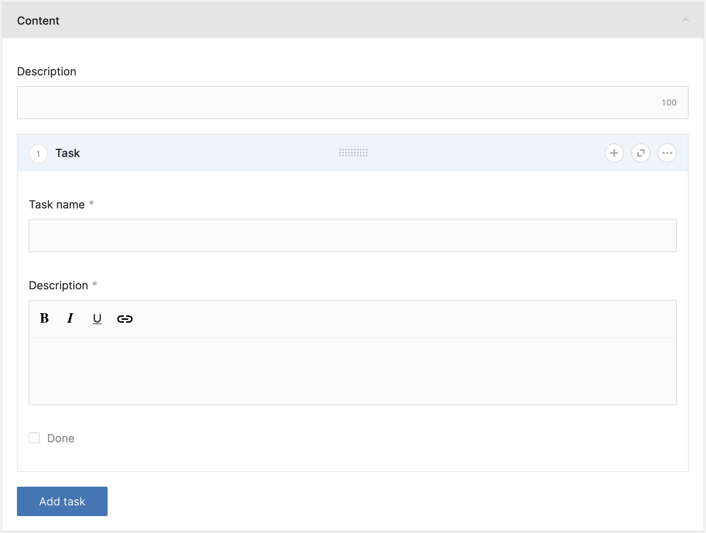

# Using JSON repeaters

Usually repeaters are used for creating related models. However, in some cases you just want
repeated data on the module you are working on without having to create a new model.

That's where repeaters come in.

## Base setup

For this guide we will create a very simple, non translatable module called "Project", in this project
we will create simple "tasks".
""
So let's go ahead and create our Project module:

`php artisan twill:make:module Project`

For simplicity you can answer `no` to all the questions. Follow the guidance to add the module to your
routes and navigation file, but do not run the migration yet!

## Updating the migration

In our migration we will add a json field `tasks` that will hold our task data.

:::filename:::
`database/migrations/2022_04_11_064051_create_projects_tables.php`
:::#filename:::

```phptorch
{
  "file": "./json_repeaters/migration.php",
  "diffInMethod": {
    "method": "up",
    "start": 4,
    "end": 4 
  }
}
```

Now you can run your migrations!

## The repeater

Now we will make the repeater, this is the form that will be used to store data in the json column.

Create a new file: `resources/views/admin/repeaters/tasks.blade.php`

:::filename:::
`resources/views/admin/repeaters/tasks.blade.php`
:::#filename:::

```phptorch
{
  "file": "./json_repeaters/tasks.blade.php",
  "simple": true
}
```

And in your form we will add the repeater field:

:::filename:::
`resources/views/admin/projects/form.blade.php`
:::#filename:::

```phptorch
{
  "file": "./json_repeaters/form.blade.php",
  "simple": true
}
```

At this point when you go into the admin panel you can add a new task, saving however, will not work yet.



## The model and repository

To make our data save we have to update our model and repository.

In our model we will add a [cast](https://laravel.com/docs/10.x/eloquent-mutators#attribute-casting),
and while we are there we can also make the `tasks` fillable.

:::filename:::
`app/Models/Project.php`
:::#filename:::

```phptorch
{
  "file": "./json_repeaters/Project.php",
  "diffProperties": ["casts", "fillable"]
}
```

In our repository we have to set `tasks` to be a json repeater, this way Twill knows how to handle
the data. In addition to that we need to add the `HandleJsonRepeaters` trait.

:::filename:::
`app/Repositories/ProjectRepository.php`
:::#filename:::

```phptorch
{
  "file": "./json_repeaters/ProjectRepository.php",
  "diffProperties": "jsonRepeaters",
  "diffTraits": "A17\\Twill\\Repositories\\Behaviors\\HandleJsonRepeaters"
}
```

And that should be it. We can now go to our form and add tasks!
