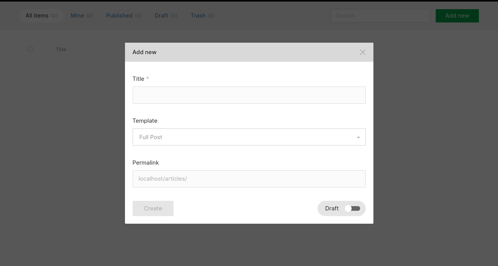
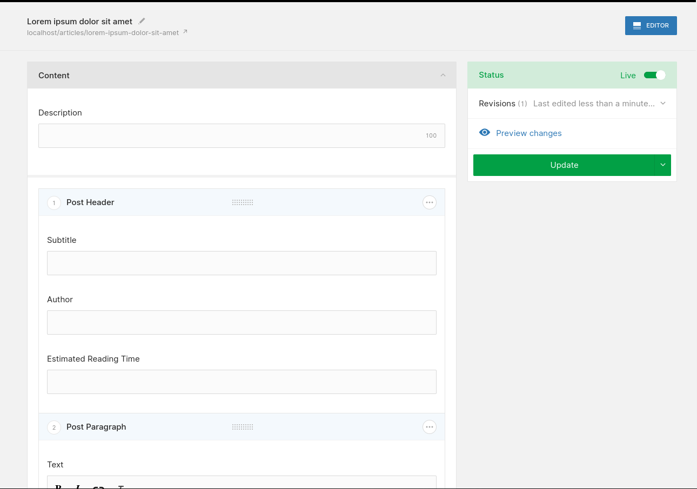

# Prefilling a block editor from a selection of templates

Objectives:

- Create a new module with a `template` field
- Prefill the block editor for new items according to the selected template

Versions used at the time of writing:

|            | Version |
|:-----------|:-------:|
| PHP        | 8.0     |
| Laravel    | 8.x     |

## Create the new module

```
php artisan twill:make:module articles -B
```

We'll make sure to enable blocks on the module, everything else is optional. In this example, we won't be using
translations, but they can be added with minor changes.

## Update the migration

We'll add the `template` field to the generated migration:

:::filename:::
`database/migrations/2021_09_19_131244_create_articles_tables.php`
:::#filename:::

```phptorch
{
  "file": "./prefill-block-editor-from-template/2021_09_19_131244_create_articles_tables.php",
  "collapseAll": "",
  "focusMethods": "up",
  "diffInMethod": {
    "method": "up",
    "start": 7,
    "end": 7
  }
}
```

Then, we'll run the migrations:

```
php artisan migrate
```

and add the module to our `routes/admin.php` and `config/twill-navigation.php`.

## Update the model

In this example, we imagine 3 templates that our authors can choose from:

- Full Article: an original article on our blog
- Linked Article: a short article to summarize and share interesting articles from other blogs
- Empty: a blank canvas

We'll start by adding our new field to the fillables:

:::filename:::
`app/Models/Article.php`
:::#filename:::

```php
protected $fillable = [
    'published',
    'title',
    'description',
    'position',
    'template',
];
```

Then, we'll define some constants for our template options:

:::filename:::
`app/Models/Article.php`
:::#filename:::

```php
public const DEFAULT_TEMPLATE = 'full_article';

public const AVAILABLE_TEMPLATES = [
    [
        'value' => 'full_article',
        'label' => 'Full Article',
        'block_selection' => ['article-header', 'article-paragraph', 'article-references'],
    ],
    [
        'value' => 'linked_article',
        'label' => 'Linked Article',
        'block_selection' => ['article-header', 'linked-article'],
    ],
    [
        'value' => 'empty',
        'label' => 'Empty',
        'block_selection' => [],
    ],
];
```

We'll add an attribute accessor to get the template name for the currently selected template value:

:::filename:::
`app/Models/Article.php`
:::#filename:::

```php
public function getTemplateLabelAttribute()
{
    $template = collect(static::AVAILABLE_TEMPLATES)->firstWhere('value', $this->template);

    return $template['label'] ?? '';
}
```

This will be useful in our `create.blade.php` view below.

## Add the `template` field to the create modal

When running `php artisan twill:make:module`, we get a `form.blade.php` to define the main form for our module. In
addition, it's also possible to redefine the fields that are displayed in the create modal, before the form:



We'll copy Twill's built-in view from `vendor/area17/twill/views/partials/create.blade.php` into our project, then add
our `template` field:

:::filename:::
`resources/views/admin/articles/create.blade.php`
:::#filename:::

```phptorch
{
  "file": "./prefill-block-editor-from-template/articles_create.blade.php",
  "simple": true
}
```

## Create some blocks

```
php artisan twill:make:block article-header
php artisan twill:make:block article-paragraph
php artisan twill:make:block article-references
php artisan twill:make:block linked-article
```

:::filename:::
`resources/views/twill/blocks/article-header.blade.php`
:::#filename:::

```phptorch
{
  "file": "./prefill-block-editor-from-template/blocks_article-header.blade.php",
  "simple": true
}
```

:::filename:::
`resources/views/twill/blocks/article-paragraph.blade.php`
:::#filename:::

```phptorch
{
  "file": "./prefill-block-editor-from-template/blocks_article-paragraph.blade.php",
  "simple": true
}
```

:::filename:::
`resources/views/twill/blocks/article-references.blade.php`
:::#filename:::

```phptorch
{
  "file": "./prefill-block-editor-from-template/blocks_article-references.blade.php",
  "simple": true
}
```

:::filename:::
`resources/views/twill/blocks/linked-post.blade.php`
:::#filename:::

```phptorch
{
  "file": "./prefill-block-editor-from-template/blocks_linked-post.blade.php",
  "simple": true
}
```

## Add the editor to our form

We'll add the block editor field to our form:

:::filename:::
`resources/views/admin/articles/form.blade.php`
:::#filename:::

```phptorch
{
  "file": "./prefill-block-editor-from-template/articles_form.blade.php",
  "simple": true
}
```

## Prefill the blocks on create

With this, all that's needed is to initialize the block editor from the selected template. We'll update our model to add
the prefill operation:

:::filename:::
`app/Models/Article.php`
:::#filename:::

```phptorch
{
  "file": "./prefill-block-editor-from-template/Article.php",
  "collapseAll": "",
  "focusMethods": ["getTemplateBlockSelectionAttribute", "prefillBlockSelection"] 
}
```

Then, we'll hook into the repository's `afterSave()`:

:::filename:::
`app/Repositories/ArticleRepository.php`
:::#filename:::

```phptorch
{
  "file": "./prefill-block-editor-from-template/ArticleRepository.php",
  "collapseAll": "",
  "focusMethods": "afterSave"
}
```

The check on `$object->wasRecentlyCreated` ensures the prefill operation will only run when the record is first created.

## Finished result

And there we have it, a templating mechanism for our block editor:


