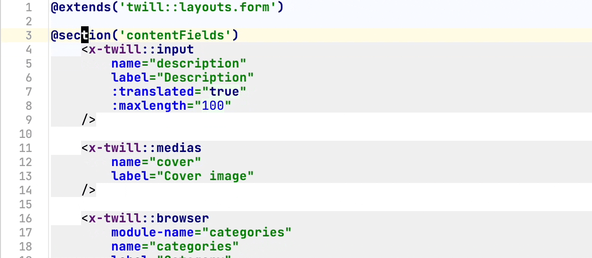

# Twill 3.0: Blade components and OOP builders

## Blade components for forms

In modern Laravel developments, it is almost certain that you have used [Blade](https://laravel.com/docs/10.x/blade),
Laravel's core templating engine.

Blade components are a great way to abstract html snippets and some logic into separate files. When used correctly it
will improve the readability of your template files a lot.

In Twill 2, forms would be defined by using the custom `@@formField()` directives.

And while this works great, it has one has some shortcomings. There is no ability to explore, formatting is not always
that easy and readability can sometimes be a bit difficult to maintain, on top of that, type errors are much harder to
detect.

With tools like [Laravel idea](https://laravel-idea.com) and [Blade lsp](https://github.com/haringsrob/laravel-dev-tools) it becomes much easier to work with Blade components and it really offers the ability to explore.



While we will remain supporting the old syntax until Twill 4, we suggest to make use of the new syntax instead:

:::tabs=currenttab.new&items.new|old:::
:::tab=name.new:::

```blade
@extends('twill::layouts.form')

@section('contentFields')
    <x-twill::wysiwyg
        name="case_study"
        label="Case study text"
        :toolbar-options="['list-ordered', 'list-unordered']"
        placeholder="Case study text"
        :maxlength="200"
        note="Hint message"
    />

    <x-twill::multi-select
        name="sectors"
        label="Sectors"
        :min="1"
        :max="2"
        :options="[
            [
                'value' => 'arts',
                'label' => 'Arts & Culture'
            ],
            [
                'value' => 'finance',
                'label' => 'Banking & Finance'
            ],
            [
                'value' => 'civic',
                'label' => 'Civic & Public'
            ],
            [
                'value' => 'design',
                'label' => 'Design & Architecture'
            ],
            [
                'value' => 'education',
                'label' => 'Education'
            ]
        ]"
    />

    <x-twill::block-editor/>
@stop
```

:::#tab:::
:::tab=name.old:::

```blade
@extends('twill::layouts.form')

@section('contentFields')
    @formField('wysiwyg', [
        'name' => 'case_study',
        'label' => 'Case study text',
        'toolbarOptions' => ['list-ordered', 'list-unordered'],
        'placeholder' => 'Case study text',
        'maxlength' => 200,
        'note' => 'Hint message',
    ])

    @formField('multi_select', [
        'name' => 'sectors',
        'label' => 'Sectors',
        'min' => 1,
        'max' => 2,
        'options' => [
            [
                'value' => 'arts',
                'label' => 'Arts & Culture'
            ],
            [
                'value' => 'finance',
                'label' => 'Banking & Finance'
            ],
            [
                'value' => 'civic',
                'label' => 'Civic & Public'
            ],
            [
                'value' => 'design',
                'label' => 'Design & Architecture'
            ],
            [
                'value' => 'education',
                'label' => 'Education'
            ]
        ]
    ])

    @formField('block_editor')
@stop
```

:::#tab:::
:::#tabs:::

As time goes on, we will introduce more components for structuring forms, but all your fields are already there!

## Form builder

If you prefer to build your forms in PHP, we also have created a whole set of classes for you to do so.

```php
<?php 
namespace App\Http\Controllers\Twill;

use A17\Twill\Models\Contracts\TwillModelContract; // [tl! collapse:start]
use A17\Twill\Services\Forms\Fields\BlockEditor;
use A17\Twill\Services\Forms\Fields\Input;
use A17\Twill\Services\Forms\Form;
use A17\Twill\Http\Controllers\Admin\SingletonModuleController as BaseModuleController;  // [tl! collapse:end]

class HomepageController extends BaseModuleController
{
protected $moduleName = 'homepages';

    public function getForm(TwillModelContract $model): Form // [tl! focus:start]
    {
        $form = parent::getForm($model);

        $form->add(
            Input::make()->name('description')->label('Description')->translatable()
        );

        $form->add(
            BlockEditor::make()
        );

        return $form;
    } // [tl! focus:end]

}
```

## Table builder

Having clear tables in the cms backend can help content managers find content much quicker.

A default table in Twill shows the publishing status, title, languages and actions. But more often than not, there are
requirements to modify this.

While this was already possible by updating the array in `$indexColumns` in your module controller, we knew we could do
better.

With Twill 3, we have build a complete table builder that you can use to structure the table the way you want!

For example, you may want to display the description of your module alongside the default columns:

```php
<?php
namespace App\Http\Controllers\Twill;

use A17\Twill\Services\Listings\Columns\Text; // [tl! collapse:start]
use A17\Twill\Services\Listings\TableColumns;
use A17\Twill\Http\Controllers\Admin\SingletonModuleController as BaseModuleController; // [tl! collapse:end]

class HomepageController extends BaseModuleController
{
protected $moduleName = 'homepages';

    protected function additionalIndexTableColumns(): TableColumns // [tl! focus:start]
    {
        $table = parent::additionalIndexTableColumns();

        $table->add(
            Text::make()->field('description')->title('Description')
        );

        return $table;
    } // [tl! focus:end]

}
```

There are of course, many more fields that you can use such as: Image, Boolean, Featured and more.

You can check all these out in our documentation.

## Navigation builder

While it will continue working as in Twill 2.x, in Twill 3 we introduce a new navigation builder. The approach is
similar to that of the settings registration. In the app service provider we can register our navigation items:

```php
TwillNavigation::addLink(
    NavigationLink::make()->forModule('blogs')->title('Blogs')
        ->setChildren([
            NavigationLink::make()->forRoute('twill.app.settings.page', ['group' => 'blog'])->title('Blog settings'),
        ])
);

TwillNavigation::addLink(
    NavigationLink::make()->forModule('pages')
);
TwillNavigation::addLink(
    NavigationLink::make()->forSingleton('homepage')
);
```

This will give you more flexibility and control over the navigation.


## Notes

We hope you enjoy Twill 3 and as always if you have feedback or questions, do not hesitate to get in touch via  [GitHub](https://github.com/area17/twill/discussions) or [Discord](https://discord.gg/cnWk7EFv8R).


