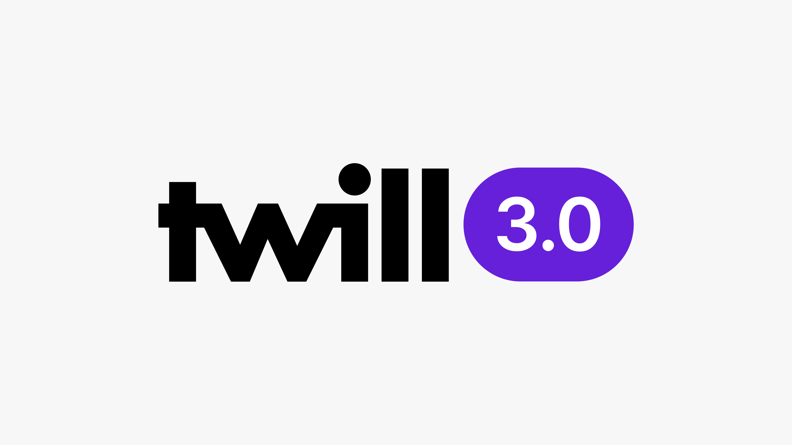

# Twill 3.0

The priorities for Twill 3.0 were clear. As Twill is a developer focused CMS framework, we wanted to create an even better developer experience and improve our documentation. 

After 3 alpha releases, 2 beta releases and 4 release candidates, we're proud to share that Twill 3.0 is now stable.  Thanks to all community members that helped us refine it and major kudos to [Rob Harings](https://github.com/haringsrob) for the herculean effort over the past year!

In this article, we will delve into the extensive updates in Twill 3.0, providing an overview of each new feature along with a short explanation to help you better understand the latest release.

## New fluent OOP form builder, table builder, and navigation builder
Twill 3.0 introduces new object-oriented programming (OOP) builders for [forms](../1_docs/3_modules/7_form-builder.md), [tables](../1_docs/3_modules/6_table-builder.md), and [navigation](../1_docs/2_getting-started/4_navigation.md), offering a more intuitive and flexible way to create and manage these elements.

## Installable examples
Twill 3.0 offers installable examples, such as [a simple page builder](../1_docs/2_getting-started/2_installation.md#content-quickstart), to help users get started quickly.

## Packages
Twill 3.0 introduces installable turnkey [packages](../1_docs/14_packages/index.md) that can include third-party integrations, content types, blocks, frontend components, templates, and even custom Vue components to customize Twill itself.

## Twill API and Twill API client
Twill 3.0 improves support for headless approaches using the [Twill API](https://github.com/area17/twill-api) and [Twill API client](https://github.com/area17/twill-api-client), allowing developers to build decoupled frontends with ease.

## New advanced CMS-driven permissions system
Twill 3.0 features a new, more [advanced permissions system](../1_docs/10_user-management/2_advanced-permissions.md) that allows for granular control over user access and actions.

## New settings forms supporting all form fields
Twill 3.0 introduces [new settings forms](../1_docs/8_settings-sections/1_index.md) that support all form fields, making it easier to configure the CMS to your specific needs.

## New class-based components blocks
Twill 3.0 introduces new [class-based components blocks](../1_docs/5_block-editor/02_creating-a-block-editor.md#content-block-component-class) for improved organization.

## Nested block editor field support
Twill 3.0 introduces support for [nested block editor fields](../1_docs/5_block-editor/10_nested-blocks.md), offering greater flexibility and organization when building content structures.

## Refreshed WYSIWYG with Tiptap by default
Twill 3.0 updates the [WYSIWYG](../1_docs/4_form-fields/02_wysiwyg.md) editor and now uses Tiptap by default, offering a more modern and user-friendly editing experience. This update also introduces a [custom link feature](../1_docs/4_form-fields/02_wysiwyg.md#content-link-browser) that uses the Twill modal UI and browser integration for a more seamless linking process in the WYSIWYG editor.

## New relations types supported by browsers and repeaters fields
Twill 3.0 expands the types of [relationships](../1_docs/6_relations/index.md) supported by browser and repeater fields, providing greater flexibility when building content structures.

## Simplified and documented methods to customize module behavior
Twill 3.0 offers easier and better-documented ways to [customize the behavior of modules](../1_docs/3_modules/5_controllers.md#content-controller-setup), allowing developers to tailor Twill to their specific needs.

## Draft revisions on top of published content
Twill 3.0 allows for draft revisions to be created and managed on top of published content, providing a more streamlined editing and publishing process.

## User timezone-aware datetime pickers
Twill 3.0 ensures that datetime pickers are aware of the user's timezone, providing a more accurate and user-friendly experience.

## New input masking capability
Twill 3.0 adds input masking capabilities, allowing users to define specific input formats for form fields.
 
## Improved preview by allowing interactivity
Twill 3.0 enhances the preview functionality by enabling interactivity, offering a more accurate representation of the final output.
 
## Automated test helpers
Twill 3.0 includes automated [test helpers](../1_docs/15_testing/index.md) to streamline the testing process and ensure a more stable and reliable CMS.
 
## Ability to limit revisions number
Twill 3.0 introduces the option to limit the number of revisions stored, helping to manage storage and performance.
 
## Ability to reset 2FA for other users (superadmin)
Twill 3.0 allows superadmins to reset two-factor authentication (2FA) for other users, providing better account management and security.
 
## Ability to disable options in select fields
Twill 3.0 offers the option to disable specific choices in select fields, giving developers more control over form inputs.
 
## Optionally generated preview/frontend view files (non-headless setup)
Twill 3.0 provides the option to generate preview and frontend view files for non-headless setups, enhancing the versatility of the CMS.

## Semi-automated and documented upgrade path based on Rector
Twill 3.0 offers a seamless [upgrade process from Twill 2](../1_docs/2_getting-started/6_upgrading.md), using Rector to automate many steps and providing detailed documentation for smoother transitions.

## PHP 8+ only
Twill 3.0 fully embraces PHP 8, bringing performance improvements, enhanced security, up-to-date language features, and improved typing.

## Massive test coverage bump
Twill 3.0 significantly increases its test coverage, now including end-to-end testing of the user experience using Laravel Dusk.

## Improved defaults
Twill 3.0 media library works on first install without third-party dependencies like Amazon S3 or Imgix, thanks to Glide. It also improves default configurations based on usage learnings.

## Namespace changes
Twill 3.0 introduces the "Twill" namespace instead of "Admin" for better clarity and organization.
 
## Refreshed documentation with Torchlight code highlighting
Twill 3.0 features updated [documentation](../1_docs/index.md) that includes Torchlight code highlighting for better readability and understanding.
 
## Separated guides section in the documentation
Twill 3.0 offers a separated [guides](../2_guides/index.md) section in the documentation and includes a new tutorial for onboarding with a straightforward, comprehensive example.

## Conclusion

Twill CMS 3.0 brings a wealth of updates and enhancements, making it an even more powerful and flexible content management system. From performance improvements and expanded feature sets to better customization options and third-party integrations, this latest release enables developers and users to build and maintain web applications more efficiently and intuitively.
