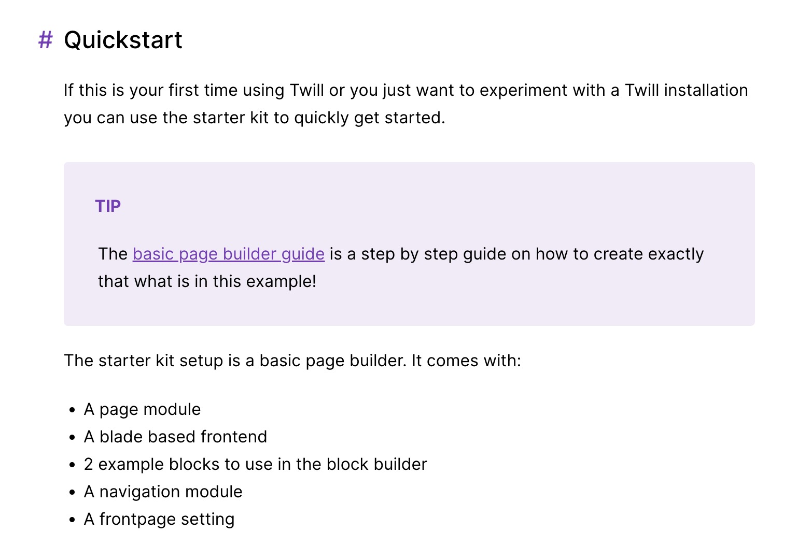

# Twill 3.0.0

In this article, we will delve into the extensive updates in Twill 3, providing an overview of each new feature along with a short explanation to help you better understand the latest release.

## Semi-automated and documented upgrade path based on Rector
Twill 3.0 offers an easier upgrade process from Twill 2, using Rector to automate many steps and providing detailed documentation for smoother transitions.

## PHP 8+ support
Twill 3.0 fully supports PHP 8+, bringing performance improvements, enhanced security, up-to-date language features, and improved typing.

## Node 18 and Vue 2.7 support
The updated version includes support for Node 18 and Vue 2.7, ensuring improved security and compatibility with the latest versions of our frontend dependencies.

## Massive test coverage bump
Twill 3.0 significantly increases its test coverage, now including end-to-end testing of the user experience using Laravel Dusk.

 
## Improved defaults
Twill 3.0 media library works on first install without third-party dependencies like Amazon S3 or Imgix, thanks to Glide. It also improves default configurations based on usage learnings.

 
## Namespace changes
Twill 3.0 introduces the "Twill" namespace instead of "Admin" for better clarity and organization.

## Installable examples
Twill 3.0 offers installable examples, such as a simple page builder, to help users get started quickly.

 
- Packages: Twill 3.0 introduces installable turnkey plugins that can include third-party integrations, content types, blocks, frontend components, templates, and even custom Vue components to customize Twill itself.
 
- Twill API and Twill API client: Twill 3.0 adds support for a headless approach using the Twill API and Twill API client, allowing developers to build decoupled frontends with ease.
 
- Nuxt.js example: Twill 3.0 provides an example of how to use the platform with the popular Nuxt.js framework for building server-rendered Vue.js applications.
 
- New fluent OOP form builder, table builder, and navigation builder: Twill 3.0 introduces new object-oriented programming (OOP) builders for forms, tables, and navigation, offering a more intuitive and flexible way to create and manage these elements.
 
- Simplified and documented methods to customize module behavior: Twill 3.0 offers easier and better-documented ways to customize the behavior of modules, allowing developers to tailor Twill to their specific needs.
 
- Permalink, modal options, and listing options: Twill 3.0 introduces several new features, including permalink support, modal options, and enhanced listing options for a more customizable experience.
 
- User timezone-aware datetime pickers: Twill 3.0 ensures that datetime pickers are aware of the user's timezone, providing a more accurate and user-friendly experience.
 
- New class-based components blocks: Twill 3.0 introduces new class-based components blocks for improved organization and performance.
 
- New relations types supported by browsers and repeaters fields: Twill 3.0 expands the types of relationships supported by browser and repeater fields, providing greater flexibility when building content structures.
 
- Refreshed WYSIWYG with Tiptap by default: Twill 3.0 updates the WYSIWYG editor and now uses Tiptap by default, offering a more modern and user-friendly editing experience.
 
- Custom link feature with Twill modal UI and browser integration: Twill 3.0 introduces a custom link feature that uses the Twill modal UI and browser integration for a more seamless linking process.
 
- Easy way to add custom toolbar icons to wrap content: Twill 3.0 makes it simple to add custom toolbar icons for wrapping content, providing additional customization options.
 
- New input masking capability: Twill 3.0 adds input masking capabilities, allowing users to define specific input formats for form fields.
 
- Nested block editor field support: Twill 3.0 introduces support for nested block editor fields, offering greater flexibility and organization when building content structures.
 
- New advanced CMS-driven permissions system: Twill 3.0 features a new, more advanced permissions system that allows for granular control over user access and actions.
 
- New settings forms supporting all form fields: Twill 3.0 introduces new settings forms that support all form fields, making it easier to configure the CMS to your specific needs.
 
- Draft revisions on top of published content: Twill 3.0 allows for draft revisions to be created and managed on top of published content, providing a more streamlined editing and publishing process.
 
- Improved preview by allowing interactivity: Twill 3.0 enhances the preview functionality by enabling interactivity, offering a more accurate representation of the final output.
 
- Achieved headless blocks previews with Nuxt (TBD example): Twill 3.0 supports headless block previews using the Nuxt.js framework, showcasing the flexibility of the CMS in headless setups.
 
- Automated test helpers: Twill 3.0 includes automated test helpers to streamline the testing process and ensure a more stable and reliable CMS.
 
- Ability to limit revisions number: Twill 3.0 introduces the option to limit the number of revisions stored, helping to manage storage and performance.
 
- Ability to reset 2FA for other users (superadmin): Twill 3.0 allows superadmins to reset two-factor authentication (2FA) for other users, providing better account management and security.
 
- Ability to disable options in select fields: Twill 3.0 offers the option to disable specific choices in select fields, giving developers more control over form inputs.
 
- Optionally generated preview/frontend view files (non-headless setup): Twill 3.0 provides the option to generate preview and frontend view files for non-headless setups, enhancing the versatility of the CMS.
 
- Refreshed documentation with Torchlight code highlighting: Twill 3.0 features updated documentation that includes Torchlight code highlighting for better readability and understanding.
 
- Separated guides section in the documentation, including a new tutorial to onboard with a simple but complete example: Twill 3.0 offers a separated guides section in the documentation and includes a new tutorial for onboarding with a straightforward, comprehensive example.

## Conclusion

Twill CMS 3.0 brings a wealth of updates and enhancements, making it an even more powerful and flexible content management system. From performance improvements and expanded feature sets to better customization options and third-party integrations, this latest release enables developers and users to build and maintain web applications more efficiently and intuitively.
