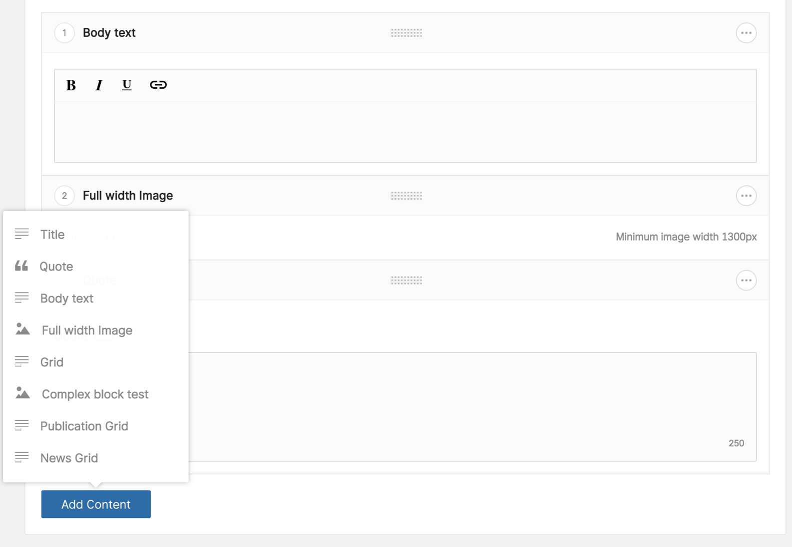

# Block Editor



Form views:
```html
<x-twill::block-editor />

@php
    $blocks = [
        'title',
        'quote',
        'text'
    ];
@endphp

<x-twill::block-editor
    :blocks="$blocks"
/>
```

From builder:
```php
BlockEditor::make()

BlockEditor::make()
    ->blocks(['title', 'quote', 'text'])
```

::: details Old method
```php
@formField('block_editor', [
    'blocks' => ['title', 'quote', 'text', 'image', 'grid', 'test', 'publications', 'news']
])
```
:::

See [Block editor](/block-editor/)

| Option           | Description                                                                 | Type/values    | Default value |
|:-----------------|:----------------------------------------------------------------------------|:---------------|:--------------|
| blocks           | Array of blocks                                                             | array          |               |
| label            | Label used for the button                                                   | string         | 'Add Content' |
| withoutSeparator | Defines if a separator before the block editor container should be rendered | true<br/>false | false         |
