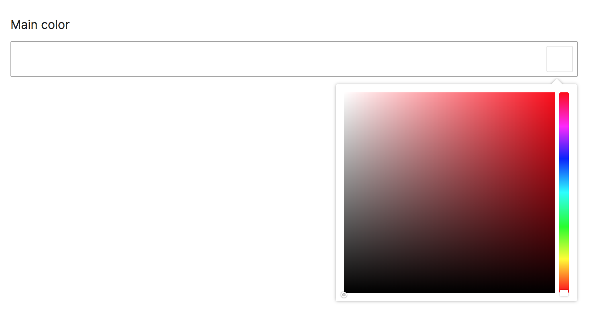

# Color



Form view:
```html
<x-twill::color
    name="main_color"
    label="Main color"
/>
```

Form builder:
```php
Color::make()
    ->name('featured')
```

::: details Old method
```php
@formField('color', [
    'name' => 'main_color',
    'label' => 'Main color'
])
```
:::

| Option  | Description        | Type   | Default value |
|:--------|:-------------------|:-------|:--------------|
| name    | Name of the field  | string |               |
| label   | Label of the field | string |               |
| default | The default value  | string |               |

A migration to save a `color` field would be:

```php
Schema::table('posts', function (Blueprint $table) {
    ...
    $table->string('main_color', 10)->nullable();
    ...
});
```
