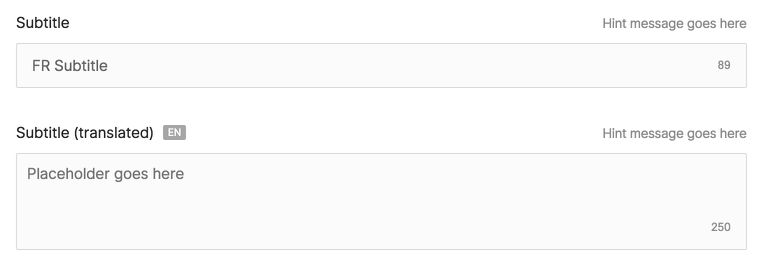

# Input



```php
@formField('input', [
    'name' => 'subtitle',
    'label' => 'Subtitle',
    'maxlength' => 100,
    'required' => true,
    'note' => 'Hint message goes here',
    'placeholder' => 'Placeholder goes here',
])

@formField('input', [
    'translated' => true,
    'name' => 'subtitle_translated',
    'label' => 'Subtitle (translated)',
    'maxlength' => 250,
    'required' => true,
    'note' => 'Hint message goes here',
    'placeholder' => 'Placeholder goes here',
    'type' => 'textarea',
    'rows' => 3
])
```

| Option      | Description                                                                                                              | Type/values                                                 | Default value |
| :---------- | :------------------------------------------------------------------------------------------------------------------------|:------------------------------------------------------------| :------------ |
| name        | Name of the field                                                                                                        | string                                                      |               |
| label       | Label of the field                                                                                                       | string                                                      |               |
| type        | Type of input field                                                                                                      | text<br/>textarea<br/>email<br/>number<br/>password<br/>url | text          |
| translated  | Defines if the field is translatable                                                                                     | true<br/>false                                              | false         |
| maxlength   | Max character count of the field                                                                                         | integer                                                     |               |
| note        | Hint message displayed above the field                                                                                   | string                                                      |               |
| placeholder | Text displayed as a placeholder in the field                                                                             | string                                                      |               |
| prefix      | Text displayed as a prefix in the field                                                                                  | string                                                      |               |
| rows        | Sets the number of rows in a textarea                                                                                    | integer                                                     | 5             |
| required    | Displays an indicator that this field is required<br/>A backend validation rule is required to prevent users from saving | true<br/>false                                              | false         |
| disabled    | Disables the field                                                                                                       | true<br />false                                             | false         |
| readonly    | Sets the field as readonly                                                                                               | true<br />false                                             | false         |
| default     | Sets a default value if empty                                                                                            | string                                                      |               |


A migration to save an `input` field would be:

```php
Schema::table('articles', function (Blueprint $table) {
    ...
    $table->string('subtitle', 100)->nullable();
    ...

});
// OR
Schema::table('article_translations', function (Blueprint $table) {
    ...
    $table->string('subtitle', 250)->nullable();
    ...
});
```

If this `input` field is used for longer strings then the migration would be:

```php
Schema::table('articles', function (Blueprint $table) {
    ...
    $table->text('subtitle')->nullable();
    ...
});
```

When used in a [block](/block-editor/creating-a-block-editor.html), no migration is needed.
